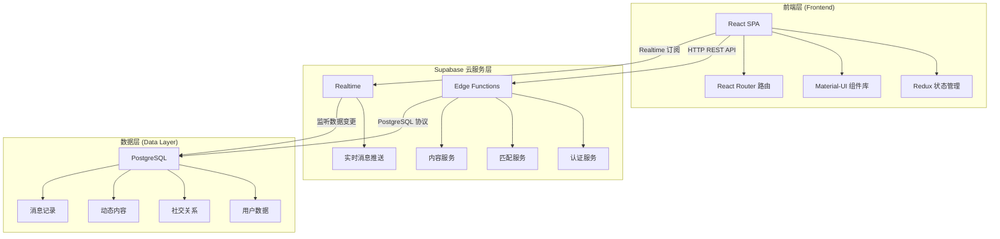
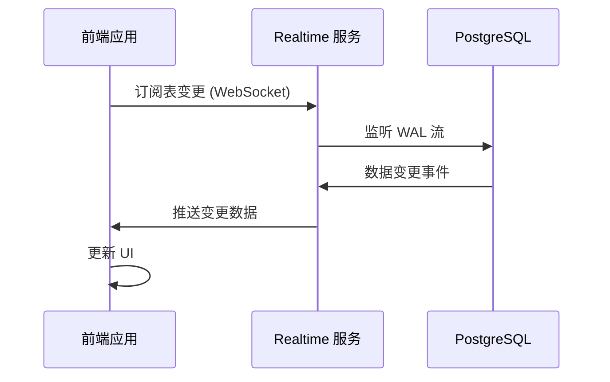
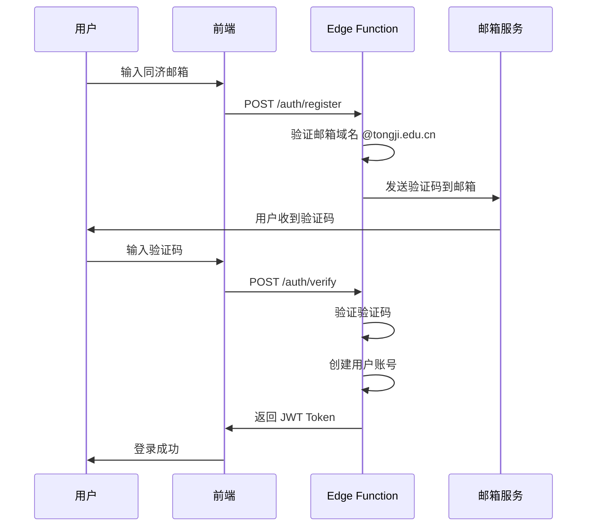
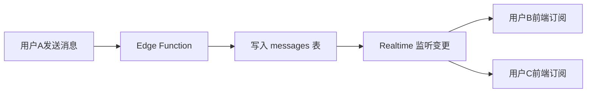
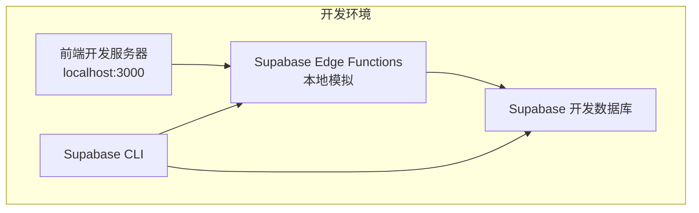
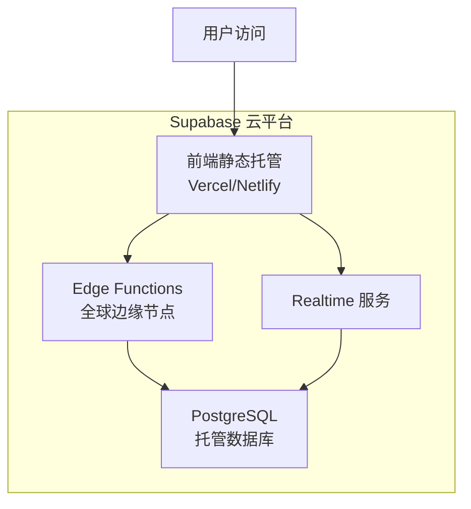

# Quipster 前后端分离架构设计文档

## 1. 项目概述

### 1.1 项目背景
Quipster 是一个面向同济大学校园的线上兴趣社交平台，旨在为学生提供安全、可信的社交环境。项目采用前后端分离架构，支持跨专业协作开发。

### 1.2 架构决策背景
基于以下考虑选择前后端分离架构：
- **团队协作需求**：前后端由不同人员负责开发
- **技术栈分离**：前端使用 React，后端使用 Supabase Edge Functions
- **安全性考虑**：避免前端直接访问数据库
- **可维护性**：模块化设计，便于独立开发和测试
- **简化部署**：利用 Supabase 托管服务，降低运维复杂度

## 2. 系统架构设计

### 2.1 整体架构图



### 2.2 技术栈选择

| 层级 | 技术栈 | 说明 |
|------|--------|------|
| 前端 | React + Redux + Material-UI | 单页应用，组件化开发 |
| 后端 | Supabase Edge Functions | Serverless 函数服务，Deno 运行时 |
| 数据库 | Supabase (PostgreSQL) | 云原生数据库服务 |
| 实时通信 | Supabase Realtime | 基于 PostgreSQL 的实时订阅 |
| 认证 | Supabase Auth + 自定义邮箱验证 | 同济邮箱专属认证 |

### 2.3 核心概念说明

#### 2.3.1 Supabase Edge Functions

**概念：**
Supabase Edge Functions 是基于 Deno 运行时的 Serverless 函数服务，用于处理后端业务逻辑。函数部署在 Supabase 的边缘节点上，具有低延迟、自动扩展的特点。

**核心特性：**

- **Serverless 架构**：无需管理服务器，按需执行，自动扩展
- **Deno 运行时**：使用 TypeScript/JavaScript 编写，支持现代 ES 模块
- **边缘计算**：函数部署在全球边缘节点，降低网络延迟
- **与数据库集成**：可直接访问 PostgreSQL 数据库，使用 Supabase 客户端
- **JWT 验证**：内置 JWT 验证机制，确保请求安全性

**适用场景：**
- 用户认证与授权
- 业务逻辑处理（如匹配算法）
- 数据验证与转换
- 第三方 API 集成

**与 Node.js + Express 的对比：**

| 特性 | Node.js + Express | Supabase Edge Functions |
|------|-------------------|-------------------------|
| 部署方式 | 需要服务器或容器 | Serverless，无需管理服务器 |
| 运行时 | Node.js | Deno |
| 扩展性 | 需手动配置负载均衡 | 自动扩展 |
| 运维成本 | 需要监控和维护 | 由 Supabase 托管 |
| 开发复杂度 | 需要配置服务器环境 | 专注于业务逻辑 |

#### 2.3.2 Supabase Realtime

**概念：**
Supabase Realtime 是基于 PostgreSQL WAL（Write-Ahead Log）的实时数据订阅服务，允许前端应用监听数据库表的数据变更，并实时接收更新。

**核心特性：**

- **数据库变更监听**：监听 INSERT、UPDATE、DELETE 事件
- **过滤条件**：支持基于条件的精准订阅
- **自动重连**：网络断开后自动重新建立连接
- **Presence 机制**：跟踪在线用户状态
- **Broadcast 机制**：客户端之间的消息广播

**工作原理：**



**适用场景：**
- 即时聊天消息推送
- 动态内容实时更新
- 在线状态显示
- 协作编辑场景

#### 2.3.3 Serverless 架构优势

**概念：**
Serverless 架构是一种云计算执行模型，开发者无需管理服务器基础设施，只需编写业务逻辑代码，由云平台自动处理资源分配、扩展和运维。

**在 Quipster 项目中的优势：**

- **降低运维复杂度**：无需配置服务器、负载均衡、监控等基础设施
- **按需付费**：只在函数执行时计费，降低项目成本
- **自动扩展**：根据请求量自动调整资源，应对流量高峰
- **快速迭代**：专注于业务逻辑开发，加快开发速度
- **适合课程项目**：简化技术栈，降低学习曲线

### 2.4 前后端分离原理

**核心原则：**

- 前端负责 UI 渲染和用户交互
- Edge Functions 负责业务逻辑和数据访问
- 通过 REST API 进行数据交换
- 前端通过 Realtime 订阅实时数据变更
- 前端不直接访问数据库（通过 Edge Functions 代理）

## 3. 认证系统设计

### 3.1 校园邮箱验证流程



### 3.2 JWT 认证机制

**Token 结构：**
```json
{
  "userId": "12345",
  "email": "student@tongji.edu.cn",
  "role": "user",
  "iat": 1640995200,
  "exp": 1641081600
}
```

**认证流程：**

1. 用户登录获取 JWT
2. 前端存储 Token 在 localStorage
3. 每次 API 请求携带 Authorization 头
4. 后端验证 Token 有效性
5. Token 过期时使用刷新机制

### 3.3 安全考虑

- **密码加密**：使用 bcrypt 或 Supabase 内置加密
- **Token 安全**：设置合理的过期时间
- **HTTPS 强制**：Supabase 默认启用 HTTPS
- **CORS 配置**：在 Supabase 控制台配置允许的域名
- **Row Level Security**：在数据库层面控制数据访问权限

## 4. 实时通信方案

### 4.1 Supabase Realtime 实现

**消息订阅机制：**
```javascript
// 前端订阅消息表变更
const channel = supabase
  .channel('messages')
  .on('postgres_changes', {
    event: 'INSERT',
    schema: 'public', 
    table: 'messages',
    filter: `conversation_id=eq.${conversationId}`
  }, (payload) => {
    // 处理新消息
    handleNewMessage(payload.new)
  })
  .subscribe()
```

**优势：**
- 无需自建 WebSocket 服务器
- 基于数据库变更的实时推送
- 自动处理连接重连
- 适合课程项目复杂度

### 4.2 Realtime 三大功能模块

#### 4.2.1 Postgres Changes（数据库变更监听）

**用途：** 监听数据库表的 INSERT、UPDATE、DELETE 事件

**应用场景：**
- 即时聊天：监听 messages 表的新消息
- 动态更新：监听 posts 表的新动态
- 通知推送：监听 notifications 表的新通知

**实现示例：**
```javascript
// 监听新动态
supabase
  .channel('posts-channel')
  .on('postgres_changes', {
    event: 'INSERT',
    schema: 'public',
    table: 'posts'
  }, (payload) => {
    console.log('新动态:', payload.new)
  })
  .subscribe()
```

#### 4.2.2 Presence（在线状态）

**用途：** 跟踪用户的在线状态和活动状态

**应用场景：**
- 显示用户在线/离线状态
- 显示"正在输入"状态
- 显示用户当前所在页面

**实现示例：**
```javascript
// 跟踪用户在线状态
const channel = supabase.channel('online-users', {
  config: {
    presence: {
      key: 'user_id'
    }
  }
})

channel
  .on('presence', { event: 'sync' }, () => {
    const newState = channel.presenceState()
    console.log('在线用户:', newState)
  })
  .subscribe()

// 用户上线
channel.track({ 
  user_id: '123',
  online_at: new Date().toISOString()
})
```

#### 4.2.3 Broadcast（消息广播）

**用途：** 客户端之间的实时消息广播

**应用场景：**
- 群聊消息
- 实时协作
- 游戏同步

**实现示例：**
```javascript
// 发送广播消息
channel.send({
  type: 'broadcast',
  event: 'chat-message',
  payload: { message: 'Hello!' }
})

// 接收广播消息
channel
  .on('broadcast', { event: 'chat-message' }, (payload) => {
    console.log('收到消息:', payload)
  })
  .subscribe()
```

### 4.3 消息流设计



**流程说明：**
1. 用户 A 通过 Edge Function 发送消息
2. Edge Function 将消息写入 messages 表
3. Realtime 服务监听到数据库变更
4. Realtime 推送变更到订阅的前端应用
5. 用户 B、C 的前端应用接收到新消息并更新 UI

## 5. API 接口规范

### 5.1 RESTful API 设计原则

**端点命名规范：**

- Edge Functions 路由：`/functions/v1/{function-name}`
- 资源使用复数名词：`/users`, `/posts`
- 嵌套资源：`/users/{id}/posts`
- 动作使用动词：`/auth/login`

**HTTP 方法使用：**

- GET：获取资源
- POST：创建资源
- PUT：更新完整资源
- PATCH：部分更新资源
- DELETE：删除资源

### 5.2 统一响应格式

**成功响应：**
```json
{
  "success": true,
  "data": {},
  "message": "操作成功"
}
```

**错误响应：**
```json
{
  "success": false,
  "error": {
    "code": "AUTH_001",
    "message": "认证失败"
  }
}
```

### 5.3 主要 API 端点

| 模块 | 端点 | 方法 | 描述 |
|------|------|------|------|
| 认证 | `/functions/v1/auth/register` | POST | 用户注册 |
| 认证 | `/functions/v1/auth/login` | POST | 用户登录 |
| 用户 | `/functions/v1/users` | GET | 获取用户列表 |
| 用户 | `/functions/v1/users/{id}` | GET | 获取用户详情 |
| 匹配 | `/functions/v1/matches` | GET | 获取匹配推荐 |
| 聊天 | `/functions/v1/conversations` | GET | 获取会话列表 |
| 动态 | `/functions/v1/posts` | POST | 发布动态 |
| 树洞 | `/functions/v1/anonymous-posts` | POST | 发布匿名帖子 |

## 6. 开发协作指南

### 6.1 前后端协作流程

**接口定义阶段：**

1. 前后端共同确定 API 接口规范
2. 定义 Edge Functions 接口文档
3. 确定数据格式和错误处理机制

**并行开发阶段：**

1. 后端开发 Edge Functions 并部署到 Supabase
2. 前端基于已部署的函数进行开发
3. 定期同步接口变更

**集成测试阶段：**

1. 前后端联调测试
2. 性能和安全测试
3. 用户验收测试

### 6.2 环境配置要求

**前端环境：**
```bash
# 依赖安装
npm install react react-dom redux @mui/material @supabase/supabase-js

# 环境变量
VITE_SUPABASE_URL=your_supabase_url
VITE_SUPABASE_ANON_KEY=your_anon_key
```

**后端环境（Edge Functions）：**
```bash
# 安装 Supabase CLI
npm install -g supabase

# 登录 Supabase
supabase login

# Edge Functions 环境变量（在 Supabase 控制台配置）
SUPABASE_URL=your_supabase_url
SUPABASE_SERVICE_ROLE_KEY=your_service_role_key
JWT_SECRET=your_jwt_secret
```

**Edge Functions 项目结构：**
```
supabase/
├── functions/
│   ├── auth/
│   │   └── index.ts          # 认证相关函数
│   ├── matches/
│   │   └── index.ts          # 匹配推荐函数
│   ├── posts/
│   │   └── index.ts          # 动态相关函数
│   └── _shared/
│       └── supabaseClient.ts # 共享的 Supabase 客户端
└── config.toml               # Supabase 配置文件
```

### 6.3 测试策略

**单元测试：**
- 前端：Jest + React Testing Library
- Edge Functions：Deno 内置测试框架

**集成测试：**
- API 接口测试
- 数据库操作测试
- 认证流程测试

**端到端测试：**
- Cypress 或 Playwright
- 用户流程测试

## 7. 部署架构

### 7.1 开发环境配置



**开发流程：**
1. 前端运行在 `http://localhost:3000`
2. 使用 Supabase CLI 本地开发 Edge Functions
3. 使用 Supabase 开发环境数据库
4. 热重载支持快速开发

**本地开发命令：**
```bash
# 安装 Supabase CLI
npm install -g supabase

# 登录 Supabase
supabase login

# 启动本地开发环境
supabase start

# 本地运行 Edge Functions
supabase functions serve

# 部署 Edge Functions
supabase functions deploy
```

### 7.2 生产环境部署方案

**部署架构：**


**部署步骤：**

1. **前端部署**
   - 构建静态文件：`npm run build`
   - 部署到 Vercel 或 Netlify
   - 配置环境变量（Supabase URL 和 Key）

2. **后端部署**
   - 使用 Supabase CLI 部署 Edge Functions
   - 配置环境变量（数据库连接、JWT 密钥等）
   - 函数自动部署到全球边缘节点

3. **数据库配置**
   - 在 Supabase 控制台创建表结构
   - 配置 Row Level Security (RLS) 策略
   - 启用 Realtime 功能

**Supabase 托管服务优势：**

| 服务 | 传统方案 | Supabase 方案 |
|------|----------|---------------|
| 数据库 | 自建 PostgreSQL | 托管 PostgreSQL，自动备份 |
| 后端 | 服务器 + Node.js | Edge Functions，无需服务器 |
| 实时通信 | 自建 WebSocket | Realtime 服务，开箱即用 |
| 认证 | 自建 JWT 系统 | Supabase Auth，支持多种登录方式 |
| 存储 | 自建文件服务器 | Supabase Storage，CDN 加速 |
| 运维 | 需要监控和维护 | 由 Supabase 托管 |


**架构核心优势：**

- **简化部署**：无需管理服务器，专注于业务逻辑开发
- **降低成本**：按需付费，适合课程项目预算
- **快速迭代**：Serverless 架构支持快速开发和部署
- **自动扩展**：应对流量波动，无需手动配置
- **实时通信**：Realtime 服务开箱即用，无需自建 WebSocket