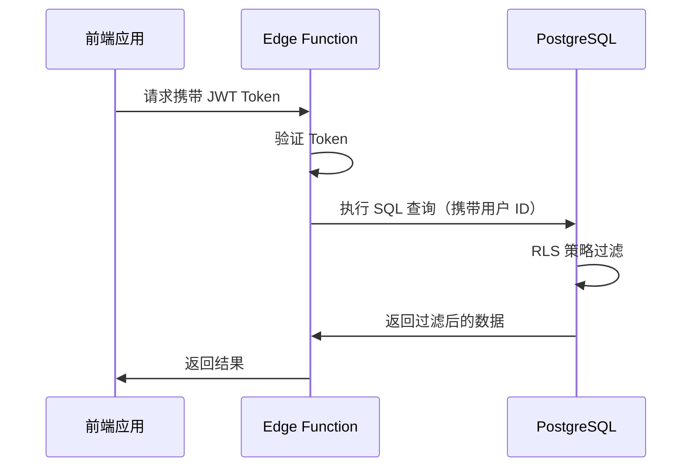

toolName: Skill
            
status: success
          
          
我已经加载了演讲设计技能。基于你的系统设计文档，我需要先了解一些关键信息来帮你设计演讲：
        
            
toolName: AskUserQuestion
            
status: success
          
          

        
            
toolName: view_files
            
status: success
          
            
filePath: d:\aa\copyQuipster\Quipster\Files\系统设计文档.md
          

        
            
toolName: AskUserQuestion
            
status: success
          
          

        
            
toolName: search_by_regex
            
status: success
          
query: 数据设计
          

        
            
toolName: view_files
            
status: success
          
            
filePath: d:\aa\copyQuipster\Quipster\Files\系统设计文档.md
          
好的！我已经找到了"## 6. 数据设计"章节的完整内容。现在我将基于演讲设计原则，为你设计一个 15-20 分钟的数据设计演讲方案。

## 演讲设计方案

### 一、演讲结构规划（15-20 分钟）

基于混合受众特点，我将演讲分为四个部分：

**第一部分：数据设计概览（3-4 分钟）**
- 核心信息：系统数据架构的整体设计思路
- 关键要点：21张表的模块化划分、ER图展示

**第二部分：核心数据模型（6-8 分钟）**
- 核心信息：用户、社交、内容三大核心模块的数据设计
- 关键要点：表结构设计、字段约束、关系设计

**第三部分：数据安全与权限（4-5 分钟）**
- 核心信息：RLS机制和隐私分级模型
- 关键要点：Row Level Security原理、三级隐私保护

**第四部分：技术亮点与总结（2-3 分钟）**
- 核心信息：数据设计的创新点和优势
- 关键要点：Supabase优势、安全策略、性能优化

---

### 二、详细幻灯片设计

#### 幻灯片 1：标题页
**内容**：
```
Quipster 系统设计
数据架构与安全策略

汇报人：[姓名]
时间：[日期]
```

**设计建议**：简洁封面，使用项目主题色

---

#### 幻灯片 2：数据设计概览
**Assertion**：系统采用模块化数据设计，21张表支撑8大功能模块

**Evidence**：
- 模块划分表格（简化版）：

| 模块 | 表数量 | 核心表 |
|------|--------|--------|
| 用户管理 | 3 | users, tags, user_tags |
| 社交关系 | 2 | matches, friendships |
| 即时通讯 | 3 | conversations, messages, conversation_members |
| 内容管理 | 3 | posts, anonymous_posts, likes |
| 问答系统 | 4 | questions, answers, question_tags, ai_answers |
| 活动社群 | 3 | activities, activity_participants, groups |
| 知识库 | 1 | knowledge_base |
| 系统治理 | 2 | reports, credit_records |

**演讲要点**：
- 强调模块化设计的优势：解耦、易维护、可扩展
- 说明表数量的合理性：避免过度设计

---

#### 幻灯片 3：数据库 ER 图概览
**Assertion**：实体关系图清晰展示数据表之间的关联关系

**Evidence**：
- 展示 ER 图的核心部分（不要展示完整的大图，太复杂）
- 建议分三个区域展示：
  1. 用户与标签关系
  2. 社交与匹配关系
  3. 内容与互动关系

**设计建议**：
- 使用颜色区分不同模块
- 突出显示外键关系
- 避免一次性展示所有表

---

#### 幻灯片 4：核心表设计 - 用户表
**Assertion**：用户表设计兼顾完整性与隐私保护

**Evidence**：
- 核心字段展示（表格形式）：

| 字段 | 类型 | 约束 | 说明 |
|------|------|------|------|
| id | UUID | PK, FK | 关联 Supabase Auth |
| email | TEXT | UK, NOT NULL | 同济邮箱 |
| nickname | TEXT | UK, NOT NULL | 2-20字符 |
| credit_score | INTEGER | CHECK (0-100) | 信用积分 |
| visibility | SMALLINT | CHECK (0,1) | 隐私级别 |

**演讲要点**：
- 解释为什么使用 UUID 而非自增 ID
- 强调唯一性约束的重要性
- 说明信用积分的设计意图

---

#### 幻灯片 5：核心表设计 - 匹配与好友关系
**Assertion**：匹配表记录操作历史，好友表管理关系状态

**Evidence**：
- 匹配流程图：

```
用户A 右滑 用户B → matches表记录 (action='like')
                    ↓
用户B 已右滑 用户A？ → 是 → friendships表建立好友关系
                    ↓ 否
                等待用户B操作
```

- 关键约束：
  - `UNIQUE (user_id, target_user_id)` - 防止重复匹配
  - `user_id <> target_user_id` - 防止自己匹配自己

**演讲要点**：
- 解释双向匹配的实现逻辑
- 强调数据约束的重要性

---

#### 幻灯片 6：核心表设计 - 消息系统
**Assertion**：消息表设计支持实时通讯和历史记录查询

**Evidence**：
- 表结构关键设计：
  - `conversation_id` - 会话分组
  - `sender_id` + `receiver_id` - 双向消息
  - `message_type` - 支持文本、图片等多种类型
  - `created_at DESC` - 时间倒序索引

- 性能优化索引：
```sql
CREATE INDEX idx_messages_conversation 
ON messages (conversation_id, created_at DESC);
```

**演讲要点**：
- 解释为什么需要 conversation_id
- 说明索引设计对查询性能的影响

---

#### 幻灯片 7：RLS 机制原理
**Assertion**：Row Level Security 在数据库层面实现细粒度权限控制

**Evidence**：
- RLS 工作流程图（使用 Mermaid）：



**演讲要点**：
- 强调优势：即使 API 被绕过，数据仍然安全

---

#### 幻灯片 8：隐私分级模型
**Assertion**：三级隐私模型平衡信息公开性与用户隐私保护

**Evidence**：
- 隐私分级表格：

| 隐私级别 | 可见性 | 数据示例 | 实现方式 |
|---------|--------|---------|---------|
| 公开 | 所有用户可见 | 动态内容、公开资料 | `visibility = 1` |
| 受限 | 仅好友或匹配用户可见 | 专业、年级、联系方式 | `visibility = 0` + RLS 策略 |
| 私密 | 仅用户本人或系统可访问 | 邮箱、密码、信用分 | RLS 策略限制 |

**演讲要点**：
- 举例说明：为什么专业年级是受限而非公开
- 解释实现方式的技术细节

---

#### 幻灯片 9：RLS 策略示例
**Assertion**：通过 SQL 策略精确控制数据访问权限

**Evidence**：
- 用户表 RLS 策略代码（简化版）：

```sql
-- 用户可以查看所有公开资料
CREATE POLICY "users_select_public" ON users
  FOR SELECT
  USING (visibility = 1 OR id = auth.uid());

-- 用户只能更新自己的资料
CREATE POLICY "users_update_own" ON users
  FOR UPDATE
  USING (id = auth.uid());
```

**演讲要点**：
- 逐行解释代码含义
- 强调 `auth.uid()` 的作用：自动获取当前登录用户ID

---

#### 幻灯片 10：数据安全策略
**Assertion**：多层安全策略保护用户敏感数据

**Evidence**：
- 安全措施表格：

| 安全层面 | 措施 | 实施位置 |
|---------|------|---------|
| 密码安全 | bcrypt 加密 | Supabase Auth |
| 邮箱隐私 | RLS 策略限制 | PostgreSQL |
| 匿名树洞 | 前端不展示 user_id | 前端 + 后端 |
| 数据传输 | HTTPS/TLS 加密 | Supabase 云平台 |

**演讲要点**：
- 解释为什么匿名树洞仍需记录 user_id（审核需要）
- 强调多层防护的重要性

---

#### 幻灯片 11：技术亮点总结
**Assertion**：数据设计体现安全性、可扩展性和性能优化三大优势

**Evidence**：
- 三大优势可视化：

```
安全性
├── RLS 行级权限控制
├── 三级隐私分级模型
└── 敏感数据加密存储

可扩展性
├── 模块化表设计
├── 外键关联清晰
└── 支持功能扩展

性能优化
├── 合理的索引设计
├── 查询优化
└── 连接池管理
```

**演讲要点**：
- 总结核心设计理念
- 强调与课程要求的契合度

---

#### 幻灯片 12：结束页
**内容**：
```
谢谢聆听
欢迎提问

联系方式：[邮箱]
```

---

### 三、演讲技巧建议

#### 1. 认知负荷管理
- **每张幻灯片一个核心概念**：不要在一张幻灯片上堆砌太多信息
- **渐进式展示**：对于复杂内容（如 ER 图），使用动画逐步展示
- **代码简化**：只展示关键代码行，删除注释和次要代码

#### 2. 视觉设计原则
- **颜色一致性**：使用项目主题色（建议蓝色系，代表技术专业感）
- **字体层次**：标题用粗体，正文用常规体，代码用等宽字体
- **留白充足**：避免幻灯片过于拥挤