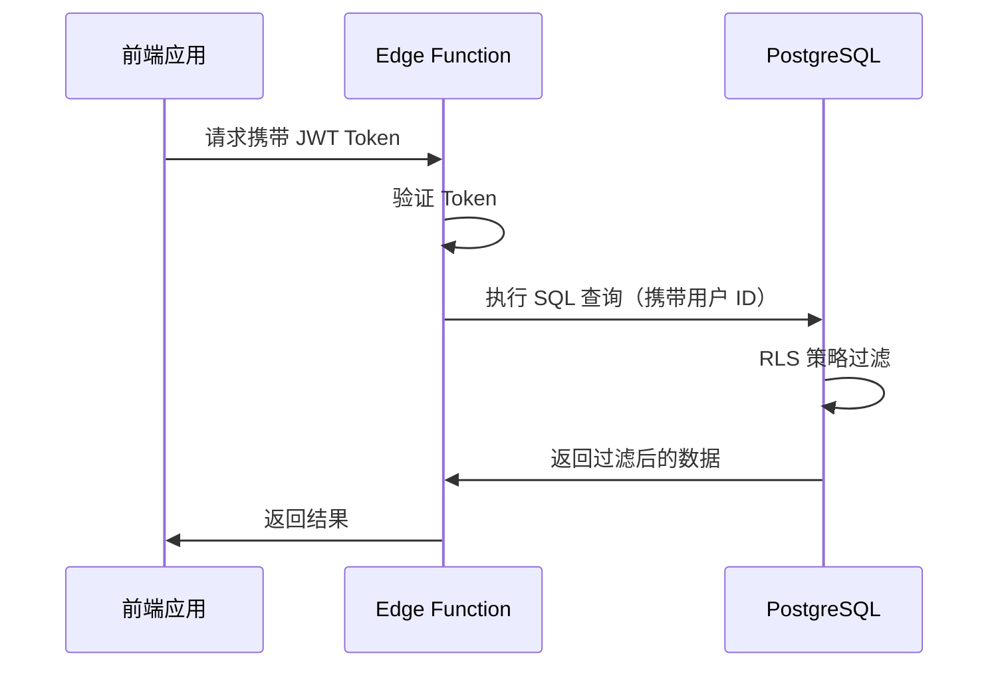

## 6. 数据设计

### 6.1 数据库 ER 图

系统采用ER图展示数据表之间的关联关系，具体设计如下：

```mermaid
erDiagram
    users ||--o{ user_tags : "拥有"
    tags ||--o{ user_tags : "关联"
    users ||--o{ posts : "发布"
    users ||--o{ likes : "点赞"
    posts ||--o{ likes : "被点赞"
    
    users ||--o{ matches : "匹配"
    users ||--o{ friendships : "好友关系"
    
    users ||--o{ conversations : "创建"
    conversations ||--o{ conversation_members : "包含"
    users ||--o{ conversation_members : "参与"
    conversations ||--o{ messages : "包含"
    users ||--o{ messages : "发送"
    
    users ||--o{ anonymous_posts : "发布"
    anonymous_posts ||--o{ likes : "被点赞"
    
    users ||--o{ questions : "提问"
    questions ||--o{ question_tags : "关联"
    tags ||--o{ question_tags : "标签"
    questions ||--o{ answers : "被回答"
    users ||--o{ answers : "回答"
    questions ||--o{ ai_answers : "AI回答"
    
    users ||--o{ activities : "创建"
    activities ||--o{ activity_participants : "包含"
    users ||--o{ activity_participants : "参与"
    
    users ||--o{ groups : "创建"
    
    users ||--o{ reports : "举报"
    users ||--o{ credit_records : "信用记录"
    
    users {
        uuid id PK
        text email UK
        text nickname UK
        text avatar_url
        text gender
        text major
        text grade
        text bio
        integer credit_score
        smallint visibility
        timestamptz created_at
        timestamptz updated_at
    }
    
    tags {
        serial id PK
        text name UK
        text category
        timestamptz created_at
    }
    
    user_tags {
        uuid user_id PK,FK
        integer tag_id PK,FK
        timestamptz created_at
    }
    
    matches {
        uuid id PK
        uuid user_id FK
        uuid target_user_id FK
        text action
        boolean is_matched
        timestamptz created_at
    }
    
    friendships {
        bigint id PK
        uuid user_id FK
        uuid friend_user_id FK
        text status
        timestamptz created_at
        timestamptz updated_at
    }
    
    conversations {
        bigint id PK
        text name
        boolean is_group
        uuid creator_user_id FK
        bigint group_id FK
        timestamptz created_at
    }
    
    conversation_members {
        bigint conversation_id PK,FK
        uuid user_id PK,FK
        text role
        timestamptz last_read_at
        timestamptz joined_at
    }
    
    messages {
        bigint id PK
        bigint conversation_id FK
        uuid sender_user_id FK
        text content
        text message_type
        text status
        timestamptz created_at
    }
    
    posts {
        bigint id PK
        uuid user_id FK
        text content
        text[] image_urls
        integer visibility
        text audit_status
        text type
        bigint parent_id FK
        bigint post_id FK
        timestamptz created_at
        timestamptz updated_at
    }
    
    anonymous_posts {
        bigint id PK
        uuid user_id FK
        text title
        text content
        text tag
        text emotion_type
        decimal emotion_score
        text[] support_resources
        boolean is_hot
        text audit_status
        text type
        bigint parent_id FK
        bigint anonymous_post_id FK
        timestamptz created_at
    }
    
    likes {
        bigint id PK
        uuid user_id FK
        text target_type
        bigint target_id FK
        timestamptz created_at
    }
    
    questions {
        bigint id PK
        uuid user_id FK
        text title
        text content
        text category
        boolean is_solved
        boolean has_ai_answer
        timestamptz created_at
    }
    
    question_tags {
        bigint question_id PK,FK
        integer tag_id PK,FK
    }
    
    answers {
        bigint id PK
        bigint question_id FK
        uuid user_id FK
        text content
        boolean is_ai_generated
        boolean is_accepted
        timestamptz created_at
    }
    
    ai_answers {
        bigint id PK
        bigint question_id FK
        text content
        timestamptz created_at
    }
    
    activities {
        bigint id PK
        uuid creator_user_id FK
        text title
        text description
        text location
        timestamptz event_time
        timestamptz start_time
        timestamptz end_time
        integer max_participants
        integer max_members
        integer visibility
        text status
        text activity_type
        text task_type
        text image_url
        bigint conversation_id FK
        timestamptz created_at
    }
    
    activity_participants {
        bigint id PK
        bigint activity_id FK
        uuid user_id FK
        text status
        timestamptz applied_at
        timestamptz joined_at
    }
    
    groups {
        bigint id PK
        text name
        text description
        text cover_url
        uuid creator_user_id FK
        integer member_count
        bigint conversation_id FK
        timestamptz created_at
    }
    
    knowledge_base {
        bigint id PK
        text title
        text content
        text category
        text[] tags
        timestamptz created_at
        timestamptz updated_at
    }
    
    reports {
        bigint id PK
        uuid reporter_id FK
        text target_type
        bigint target_id FK
        text reason
        text description
        text status
        timestamptz created_at
        timestamptz resolved_at
    }
    
    credit_records {
        bigint id PK
        uuid user_id FK
        text type
        integer amount
        text reason
        timestamptz created_at
    }
```



### 6.2 数据表结构设计

#### 6.2.1 核心表结构说明

整个系统总共设计了21张数据表，按照功能模块进行划分，具体分布如下：

**用户相关模块**包含3张表：

- `users`表负责存储用户的基本信息资料
- `tags`表用于存放系统预定义的兴趣标签
- `user_tags`表记录用户选择的标签关联关系

**社交关系模块**涉及2张表：

- `matches`表保存用户的匹配操作记录和匹配结果
- `friendships`表维护好友关系的状态信息

**聊天通信模块**有3张表：

- `conversations`表记录聊天会话的基本信息
- `conversation_members`表存储会话参与者的信息
- `messages`表保存所有的聊天消息记录

**内容发布模块**包含3张表：

- `posts`表存储用户发布的动态内容
- `anonymous_posts`表专门用于匿名树洞帖子的存储
- `likes`表统一管理所有类型的点赞关系

**问答互动模块**设计了4张表：

- `questions`表记录用户提出的问题
- `question_tags`表建立问题与标签的关联
- `answers`表存储用户对问题的回答
- `ai_answers`表保存AI生成的参考答案

**活动与学习搭子模块**有2张表：

- `activities`表统一管理活动和学习任务信息
- `activity_participants`表记录活动参与者的报名信息

**社群管理模块**包含1张表：

- `groups`表存储兴趣社群的基本信息

**知识库模块**设计了1张表：

- `knowledge_base`表用于存放系统知识内容

**治理监管模块**包含2张表：

- `reports`表记录用户的举报信息
- `credit_records`表跟踪用户信用分的变化情况

#### 6.2.2 字段约束与索引

**用户表（users）的约束设计**：

```sql
-- 主键约束设置
id UUID PRIMARY KEY REFERENCES auth.users(id) ON DELETE CASCADE

-- 唯一性约束要求
email TEXT UNIQUE NOT NULL
nickname TEXT UNIQUE NOT NULL

-- 数据检查约束
credit_score >= 0 AND credit_score <= 100
visibility IN (0, 1)
LENGTH(nickname) >= 2 AND LENGTH(nickname) <= 20

-- 索引优化设计
CREATE UNIQUE INDEX idx_users_nickname ON public.users (LOWER(nickname));
CREATE INDEX idx_users_major ON public.users (major);
CREATE INDEX idx_users_grade ON public.users (grade);
```

**匹配表（matches）的约束设计**：

```sql
-- 主键生成策略
id UUID PRIMARY KEY DEFAULT gen_random_uuid()

-- 外键关联约束
user_id UUID NOT NULL REFERENCES public.users(id) ON DELETE CASCADE
target_user_id UUID NOT NULL REFERENCES public.users(id) ON DELETE CASCADE

-- 唯一性约束
UNIQUE (user_id, target_user_id)

-- 业务逻辑检查
action IN ('like', 'dislike')
user_id <> target_user_id

-- 查询性能索引
CREATE INDEX idx_matches_user ON public.matches (user_id);
CREATE INDEX idx_matches_target ON public.matches (target_user_id);
CREATE INDEX idx_matches_action ON public.matches (user_id, action);
```

**消息表（messages）的约束设计**：

```sql
-- 主键约束定义
id UUID PRIMARY KEY DEFAULT gen_random_uuid()

-- 外键关联设置
conversation_id UUID NOT NULL REFERENCES public.conversations(id) ON DELETE CASCADE
sender_id UUID NOT NULL REFERENCES public.users(id) ON DELETE CASCADE
receiver_id UUID NOT NULL REFERENCES public.users(id) ON DELETE CASCADE

-- 数据有效性检查
LENGTH(content) > 0
message_type IN ('text', 'image')

-- 索引优化策略
CREATE INDEX idx_messages_conversation ON public.messages (conversation_id, created_at DESC);
CREATE INDEX idx_messages_sender ON public.messages (sender_id);
CREATE INDEX idx_messages_receiver ON public.messages (receiver_id);
CREATE INDEX idx_messages_unread ON public.messages (receiver_id, is_read) WHERE is_read = FALSE;
```

### 6.3 RLS 策略说明

#### 6.3.1 Row Level Security 机制

Row Level Security（RLS）是PostgreSQL数据库提供的一种行级权限控制机制，这种机制允许在数据库层面直接控制用户对数据行的访问权限，确保每个用户只能访问自己有权限的数据。

RLS的实现方式是通过为每个数据表创建策略（Policy），每个策略都定义了一个布尔表达式，只有当这个表达式返回true的时候，用户才能够访问对应的数据行。这种设计将权限控制下沉到数据库层面，即使应用层的API被绕过，数据仍然能够得到保护。

**数据访问流程**：



**RLS机制的主要优势**：

1. 权限控制在数据库层面实现，即使API层被绕过，数据仍然安全
2. 可以精确控制到每行数据的访问权限
3. 权限判断在数据库层完成，减少应用层代码复杂度
4. 确保用户只能访问自己的数据，避免信息泄露风险

#### 6.3.2 隐私分级模型

系统将用户数据按照隐私级别分为三个层次：

| 隐私级别 | 可见范围 | 数据示例 | 实现方式 |
|---------|--------|---------|---------|
| **公开（Public）** | 所有用户可见 | 动态内容、公开资料 | `visibility = 1` |
| **受限（Protected）** | 仅好友或匹配用户可见 | 专业、年级、联系方式 | `visibility = 0` + RLS 策略 |
| **私密（Private）** | 仅用户本人或系统可访问 | 邮箱、密码、信用分 | RLS 策略限制 |

**具体的RLS策略实现示例**：

```sql
-- 用户表的RLS策略配置
ALTER TABLE public.users ENABLE ROW LEVEL SECURITY;

-- 策略1：允许用户查看所有公开资料
CREATE POLICY "users_select_public" ON public.users
  FOR SELECT
  USING (visibility = 1 OR id = auth.uid());

-- 策略2：用户只能更新自己的资料
CREATE POLICY "users_update_own" ON public.users
  FOR UPDATE
  USING (id = auth.uid());

-- 消息表的RLS策略配置
ALTER TABLE public.messages ENABLE ROW LEVEL SECURITY;

-- 策略：用户只能查看自己发送或接收的消息
CREATE POLICY "messages_select_participant" ON public.messages
  FOR SELECT
  USING (sender_id = auth.uid() OR receiver_id = auth.uid());
```

### 6.4 数据安全策略

#### 6.4.1 敏感数据保护

**密码安全保护措施**：

- 采用Supabase Auth内置的bcrypt加密算法对密码进行加密
- 密码信息不以明文形式存储在数据库中
- 前端应用不展示任何与密码相关的字段信息

**邮箱隐私保护方案**：

- 邮箱字段仅在用户资料编辑页面可见
- 公开的用户资料页面不展示邮箱信息
- 通过RLS策略严格控制邮箱字段的访问权限

**匿名树洞隐私保障**：

- 前端界面不显示`user_id`字段信息
- 后端系统记录`user_id`用于内容审核和违规处理
- 数据库索引设计避免包含`user_id`字段，防止性能泄露

#### 6.4.2 数据备份与恢复

**Supabase平台自动备份机制**：

- 免费版本提供每日自动备份服务，数据保留期限为7天
- 专业版本同样每日自动备份，但数据保留期限延长至30天
- 支持Point-in-time Recovery（PITR）功能，可以恢复到任意时间点

### 6.5 性能优化策略

#### 6.5.1 索引设计原则

**复合索引的设计考虑**：

- `(user_id, created_at DESC)`复合索引支持用户主页动态列表，按时间倒序展示，避免全表扫描
- `(user_id, action, created_at)`索引支持快速查询用户匹配记录，按时间倒序排列匹配结果
- `(conversation_id, created_at DESC)`索引支持聊天记录按时间倒序加载，每次查询仅需扫描会话内数据
- `(like_count DESC, comment_count DESC, created_at DESC)`支持匿名树洞热门帖子排序

**部分索引的应用场景**：

- 活跃用户筛选：`WHERE credit_score > 80`的部分索引，优化高信用用户查询，仅索引活跃用户数据
- 未读消息查询：`WHERE is_read = FALSE`的部分索引，仅索引未读消息，大幅减少消息提醒查询时间
- 开放问题查询：`WHERE status = 'open'`的部分索引，优化问答模块中待回答问题列表查询
- 近期活动查询：`WHERE start_time > NOW() - INTERVAL '7 days'`的部分索引，优化近期活动推荐

**索引维护策略**：

- 定期分析索引使用情况，删除使用频率低的索引
- 对频繁更新的表（如点赞表）采用更保守的索引策略

#### 6.5.2 查询优化策略

**连接查询的性能优化**：

- 使用单次JOIN查询获取用户动态及其点赞数，避免N+1查询
```sql
SELECT p.*, u.nickname, u.avatar_url, COUNT(pl.user_id) as like_count
FROM posts p 
JOIN users u ON p.user_id = u.id
LEFT JOIN post_likes pl ON p.id = pl.post_id
WHERE p.user_id = $1
GROUP BY p.id, u.id
ORDER BY p.created_at DESC
LIMIT 20;
```

- 使用复合索引支持的匹配关系查询，避免子查询
```sql
SELECT m.*, u.nickname, u.avatar_url, u.major
FROM matches m
JOIN users u ON m.target_user_id = u.id
WHERE m.user_id = $1 AND m.action = 'like'
ORDER BY m.created_at DESC;
```

- 利用会话索引快速获取最新消息
```sql
SELECT m.*, u.nickname, u.avatar_url
FROM messages m
JOIN users u ON m.sender_id = u.id
WHERE m.conversation_id = $1
ORDER BY m.created_at DESC
LIMIT 50;
```

**分页查询的实现方式**：

- **游标分页技术**：基于`created_at`字段的UUID分页，避免OFFSET性能问题
```sql
-- 第一页
SELECT * FROM posts 
WHERE user_id = $1 
ORDER BY created_at DESC 
LIMIT 20;

-- 后续分页
SELECT * FROM posts 
WHERE user_id = $1 AND created_at < $2
ORDER BY created_at DESC 
LIMIT 20;
```

- 分页参数控制，动态列表每页20条，消息记录每页50条，匹配记录每页10条
- 所有时间相关查询都基于`created_at DESC`索引，确保分页性能

### 6.6 数据一致性保障

#### 6.6.1 外键约束设计

**级联操作的策略安排**：

- 用户删除时自动删除其动态、点赞、评论、匹配记录等关联数据
```sql
-- posts表级联删除
FOREIGN KEY (user_id) REFERENCES users(id) ON DELETE CASCADE

-- 匹配记录级联删除  
FOREIGN KEY (user_id) REFERENCES users(id) ON DELETE CASCADE
FOREIGN KEY (target_user_id) REFERENCES users(id) ON DELETE CASCADE
```

- 好友关系采用双向约束，但设置合理的删除顺序避免死锁
```sql
-- friendships表设计避免循环引用
CHECK (user_id < friend_user_id)  -- 确保唯一性
FOREIGN KEY (user_id) REFERENCES users(id) ON DELETE CASCADE
FOREIGN KEY (friend_user_id) REFERENCES users(id) ON DELETE CASCADE
```

- 社群创建者删除时保留社群信息，仅设置creator_id为NULL
```sql
FOREIGN KEY (creator_id) REFERENCES users(id) ON DELETE SET NULL
```

**业务逻辑的约束实现**：

- 用户匹配约束，防止用户与自己匹配
```sql
CHECK (user_id <> target_user_id)
```

- 信用分范围约束，确保信用分在合理范围内
```sql
CHECK (credit_score >= 0 AND credit_score <= 100)
```

- 动态内容长度约束，限制动态内容长度
```sql
CHECK (LENGTH(content) > 0 AND LENGTH(content) <= 500)
```

- 活动时间约束，确保活动时间合理性
```sql
CHECK (end_time IS NULL OR end_time > start_time)
```

#### 6.6.2 事务管理机制

**事务隔离级别的选择**：

- 默认隔离级别为READ COMMITTED，满足大部分查询需求
```sql
-- 默认事务级别
SET TRANSACTION ISOLATION LEVEL READ COMMITTED;
```

- 用户匹配、积分变更等关键操作使用SERIALIZABLE
```sql
-- 匹配操作事务
BEGIN ISOLATION LEVEL SERIALIZABLE;
INSERT INTO matches (user_id, target_user_id, action) VALUES ($1, $2, $3);
-- 检查是否形成双向匹配
SELECT COUNT(*) FROM matches 
WHERE user_id = $2 AND target_user_id = $1 AND action = 'like';
COMMIT;
```

**并发冲突的处理方案**：

- 动态点赞计数更新使用版本号控制
```sql
-- 点赞计数更新
UPDATE posts 
SET like_count = like_count + 1, updated_at = NOW()
WHERE id = $1 AND updated_at = $2;
-- 如果更新行数为0，说明数据已被修改，需要重试
```

- 用户积分变更使用SELECT FOR UPDATE锁定
```sql
-- 积分变更
BEGIN;
SELECT * FROM users WHERE id = $1 FOR UPDATE;
UPDATE users SET credit_score = credit_score + $2 WHERE id = $1;
INSERT INTO credit_records (user_id, type, amount, reason) 
VALUES ($1, 'reward', $2, '活动参与奖励');
COMMIT;
```

- 匹配操作失败时自动重试
```sql
-- 匹配操作重试逻辑
DO $$
DECLARE
  retry_count INTEGER := 0;
  max_retries INTEGER := 3;
BEGIN
  WHILE retry_count < max_retries LOOP
    BEGIN
      INSERT INTO matches (user_id, target_user_id, action) 
      VALUES ($1, $2, $3);
      EXIT;  -- 成功则退出循环
    EXCEPTION 
      WHEN unique_violation THEN
        -- 重复匹配，直接返回成功
        EXIT;
      WHEN serialization_failure THEN
        -- 序列化失败，重试
        retry_count := retry_count + 1;
        IF retry_count = max_retries THEN
          RAISE EXCEPTION '匹配操作失败，请重试';
        END IF;
        PERFORM pg_sleep(0.1 * retry_count);  -- 指数退避
    END;
  END LOOP;
END $$;
```