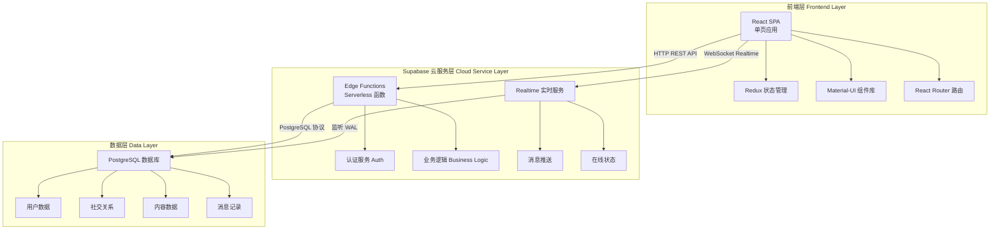
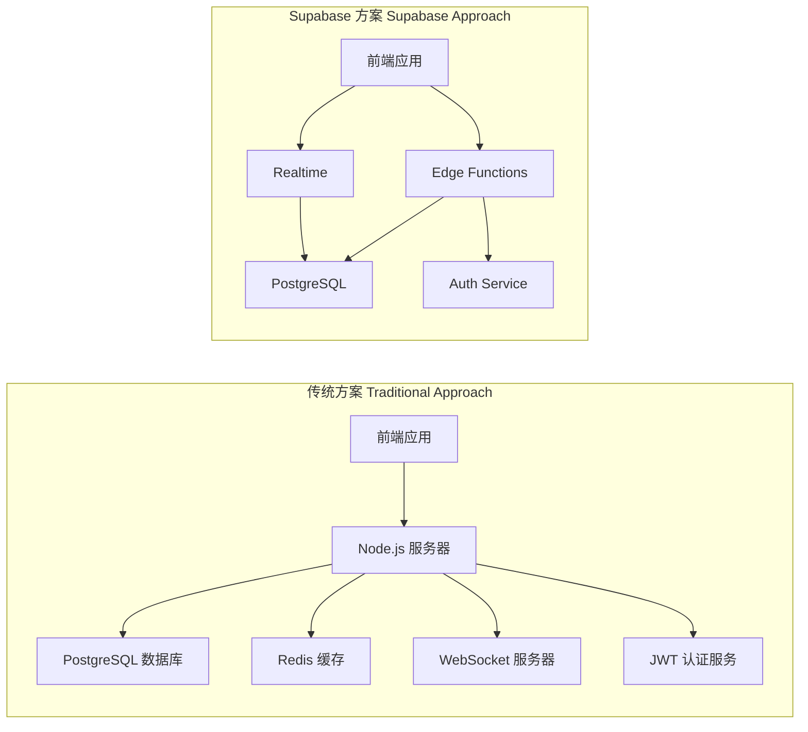
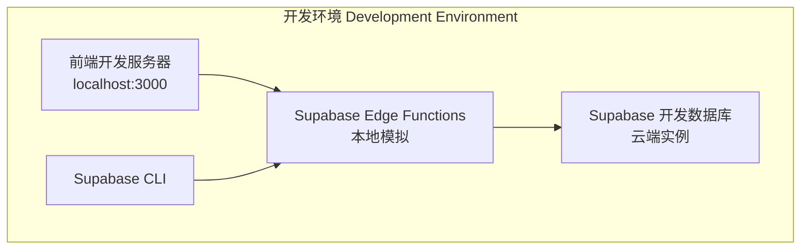
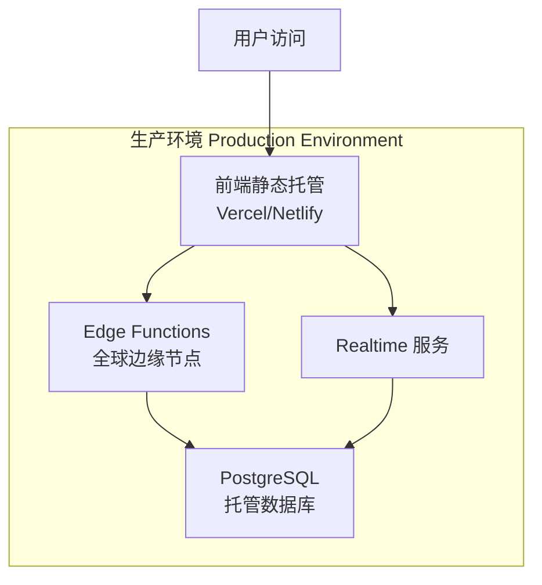
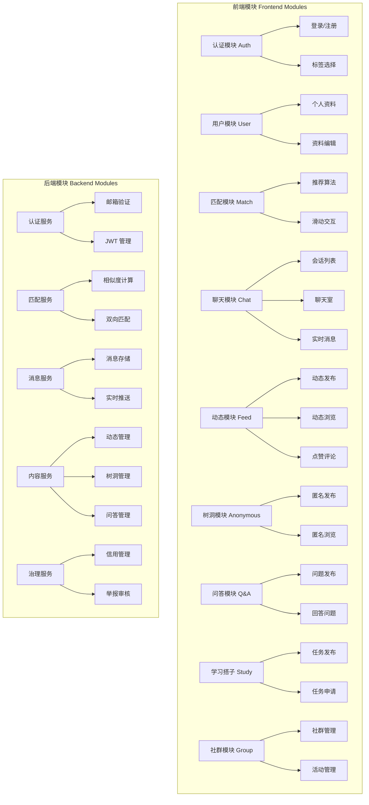
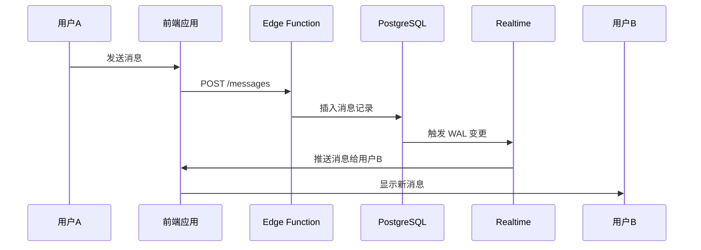
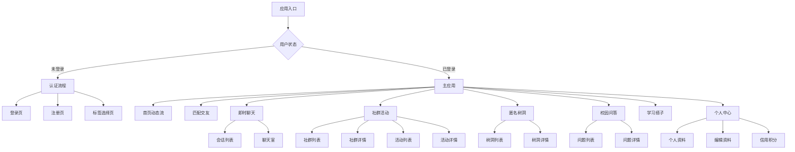
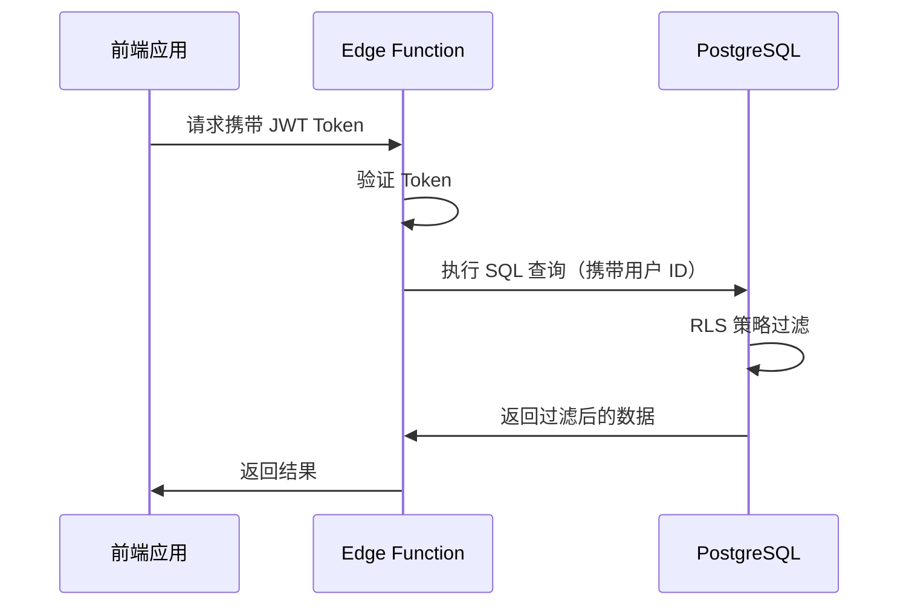

# Quipster 系统设计文档

## 1. 文档概述

### 1.1 文档目的

本文档为 Quipster 校园社交平台的系统设计文档，详细描述系统的架构设计、组件设计、接口设计、数据设计等技术细节，为课程汇报和项目评审提供技术参考。

### 1.2 适用范围

本文档适用于：

- 课程导师评审
- 学生汇报展示
- 开发团队技术参考

### 1.3 参考文档

- [需求分析文档](./需求分析文档_5.md)
- [前后端分离架构文档](./前后端分离架构文档-基于supabase.md)
- [数据库设计文档](./数据库设计-优化版.md)

---

## 2. 系统架构设计

### 2.1 整体架构图



**架构说明**：

系统采用三层架构设计：

- **前端层**：基于 React 的单页应用，负责 UI 渲染和用户交互
- **服务层**：Supabase Edge Functions 处理业务逻辑，Realtime 提供实时通信
- **数据层**：PostgreSQL 数据库存储所有业务数据

### 2.2 技术栈选型

#### 2.2.1 前端技术栈

| 技术 | 版本 | 用途 |
|------|------|------|
| React | 18.3.1 | 前端框架，组件化开发 |
| TypeScript | 5.6.3 | 类型安全的 JavaScript 超集 |
| Redux Toolkit | 2.3.0 | 全局状态管理 |
| Material-UI | 6.1.6 | UI 组件库 |
| React Router | 6.28.0 | 前端路由管理 |
| Axios | 1.7.7 | HTTP 客户端 |
| Vite | 5.4.10 | 构建工具和开发服务器 |

#### 2.2.2 后端技术栈

| 技术 | 用途 |
|------|------|
| Supabase Edge Functions | Serverless 函数服务，Deno 运行时 |
| Supabase Auth | 用户认证服务，JWT 令牌管理 |
| Supabase Realtime | 实时数据订阅，WebSocket 通信 |
| PostgreSQL | 关系型数据库 |

#### 2.2.3 开发工具

| 工具 | 用途 |
|------|------|
| Vitest | 单元测试框架 |
| ESLint | 代码质量检查 |
| Supabase CLI | 本地开发和部署工具 |

### 2.3 Supabase 与传统 PostgreSQL 方案对比



**对比分析**：

| 维度 | 传统 PostgreSQL 方案 | Supabase 方案 |
|------|---------------------|---------------|
| **服务器管理** | 需要配置和维护服务器 | Serverless，无需管理服务器 |
| **数据库运维** | 需要自行备份、监控、扩展 | 自动备份、自动扩展、托管运维 |
| **实时通信** | 需要自建 WebSocket 服务器 | Realtime 服务开箱即用 |
| **认证系统** | 需要自建 JWT 认证 | Auth 服务内置多种认证方式 |
| **开发效率** | 需要配置多个服务 | 一站式服务，快速开发 |
| **运维成本** | 需要专业运维人员 | 由 Supabase 托管 |
| **学习曲线** | 需要掌握多个技术栈 | 统一技术栈，降低复杂度 |
| **成本** | 固定服务器成本 | 按需付费，免费版适合课程项目 |

**Supabase 核心优势**：

1. **Serverless 架构**：无需管理服务器，专注于业务逻辑开发
2. **自动扩展**：根据请求量自动调整资源，应对流量波动
3. **实时通信**：Realtime 服务基于 PostgreSQL WAL，无需自建 WebSocket
4. **安全认证**：内置 Auth 服务，支持邮箱、OAuth 等多种认证方式
5. **Row Level Security**：数据库层面的权限控制，确保数据安全
6. **快速迭代**：简化技术栈，适合课程项目的快速开发需求

### 2.4 部署架构

#### 2.4.1 开发环境部署



**开发流程**：

1. 前端运行在 `http://localhost:3000`
2. Edge Functions 通过 Supabase CLI 本地开发
3. 使用 Supabase 云端开发数据库
4. 热重载支持快速迭代

#### 2.4.2 生产环境部署



**部署步骤**：

1. **前端部署**：
   - 构建静态文件：`npm run build`
   - 部署到 Vercel 或 Netlify
   - 配置环境变量（Supabase URL 和 Key）

2. **后端部署**：
   - 使用 Supabase CLI 部署 Edge Functions
   - 函数自动部署到全球边缘节点

3. **数据库配置**：
   - 在 Supabase 控制台创建表结构
   - 配置 RLS 策略
   - 启用 Realtime 功能

---

## 3. 核心组件设计

### 3.1 模块划分图



### 3.2 核心模块说明

#### 3.2.1 用户模块

**功能**：

- 用户注册与登录（同济邮箱认证）
- 个人资料管理（昵称、头像、专业、年级等）
- 兴趣标签选择与管理
- 隐私设置

**技术实现**：

- 前端：`LoginPage`、`RegisterPage`、`ProfilePage`、`EditProfilePage`
- 后端：`auth` Edge Function、`users` Edge Function
- 数据表：`users`、`user_tags`、`tags`

#### 3.2.2 匹配模块

**功能**：

- 基于兴趣标签的推荐算法
- 滑动卡片交互（左滑跳过、右滑喜欢）
- 双向匹配建立好友关系
- 匹配成功通知

**技术实现**：

- 前端：`MatchPage`
- 后端：`matches` Edge Function
- 数据表：`matches`、`user_tags`
- 算法：Jaccard 相似度计算共同标签占比

**匹配算法**：

```
匹配分数 = (共同标签数 / max(用户A标签数, 用户B标签数)) × 100
```

#### 3.2.3 聊天模块

**功能**：

- 一对一即时聊天
- 会话列表管理
- 消息已读状态
- 实时消息推送

**技术实现**：

- 前端：`ChatListPage`、`ChatRoomPage`
- 后端：`messages` Edge Function、`conversations` Edge Function
- 实时通信：Supabase Realtime 订阅 `messages` 表变更
- 数据表：`conversations`、`messages`

**实时消息流程**：



#### 3.2.4 动态模块

**功能**：

- 发布动态（文字、图片）
- 浏览动态信息流
- 点赞和评论
- 动态可见性控制

**技术实现**：

- 前端：`FeedPage`、`PostCard`、`CreatePostDialog`
- 后端：`posts` Edge Function
- 数据表：`posts`、`post_likes`、`post_comments`

#### 3.2.5 树洞模块

**功能**：

- 匿名发布帖子
- 匿名浏览和互动
- 情绪识别与资源推荐
- 热门帖子排序

**技术实现**：

- 前端：`AnonymousPage`、`AnonymousDetailPage`
- 后端：`anonymous-posts` Edge Function
- 数据表：`anonymous_posts`、`anonymous_post_tags`、`anonymous_comments`、`anonymous_post_likes`
- 隐私保护：前端不展示 `user_id`，后端记录用于审核

#### 3.2.6 问答模块

**功能**：

- 提出问题
- 回答问题
- 采纳最佳答案
- 问题分类与标签

**技术实现**：

- 前端：`QuestionsPage`、`QuestionDetailPage`
- 后端：`questions` Edge Function、`answers` Edge Function
- 数据表：`questions`、`question_tags`、`answers`

#### 3.2.7 学习搭子模块

**功能**：

- 发布学习任务
- 申请加入任务
- 审核申请成员
- 组建学习小组

**技术实现**：

- 前端：`StudyPage`
- 后端：`study-tasks` Edge Function
- 数据表：`study_tasks`、`study_task_tags`、`study_task_members`

---

## 4. UI 设计

### 4.1 页面结构图



### 4.2 核心页面说明

#### 4.2.1 登录/注册页面

**页面路径**：`/login`、`/register`

**核心功能**：

- 同济邮箱验证（仅支持 `@tongji.edu.cn` 和 `@stu.tongji.edu.cn`）
- 密码强度验证（最少 6 位）
- 昵称唯一性检查（2-20 字符）
- 邮箱验证邮件发送

**UI 组件**：

- 邮箱输入框（带格式验证）
- 密码输入框（带强度提示）
- 昵称输入框（注册时）
- 登录/注册按钮
- 错误提示信息

#### 4.2.2 匹配交友页面

**页面路径**：`/match`

**核心功能**：

- 滑动卡片展示推荐用户
- 左滑跳过、右滑喜欢
- 显示共同标签和匹配分数
- 双向匹配成功提示

**UI 组件**：

- 用户卡片（头像、昵称、专业、共同标签）
- 滑动手势区域
- 跳过/喜欢按钮
- 匹配成功弹窗

#### 4.2.3 即时聊天页面

**页面路径**：`/chat`、`/chat/:conversationId`

**核心功能**：

- 会话列表（显示最后一条消息、未读数）
- 聊天室（消息气泡、发送框）
- 实时消息推送
- 消息已读状态

**UI 组件**：

- 会话列表项（头像、昵称、最后消息、未读徽章）
- 消息气泡（区分发送者和接收者）
- 消息输入框
- 发送按钮

#### 4.2.4 动态发布与浏览页面

**页面路径**：`/`（首页）

**核心功能**：

- 动态信息流（按时间倒序）
- 发布动态（文字、图片）
- 点赞和评论
- 动态详情查看

**UI 组件**：

- 动态卡片（用户信息、内容、图片、点赞数、评论数）
- 发布对话框（文本框、图片上传）
- 点赞按钮
- 评论列表

#### 4.2.5 匿名树洞页面

**页面路径**：`/anonymous`、`/anonymous/:postId`

**核心功能**：

- 匿名帖子列表（按热度或时间排序）
- 发布匿名帖子（标题、内容、标签）
- 匿名评论和点赞
- 情绪识别与资源推荐

**UI 组件**：

- 帖子卡片（标题、内容预览、标签、点赞数、评论数）
- 发布表单（标题、内容、标签选择）
- 评论列表（匿名展示）

#### 4.2.6 学习搭子页面

**页面路径**：`/study`

**核心功能**：

- 学习任务列表（按状态筛选）
- 发布学习任务（标题、描述、人数、标签）
- 申请加入任务
- 审核申请成员

**UI 组件**：

- 任务卡片（标题、描述、标签、当前人数/目标人数、状态）
- 发布表单（标题、描述、人数、标签选择）
- 申请按钮
- 成员列表

### 4.3 页面截图预留位置

**说明**：以下位置预留用于用户补充实际页面截图。

#### 登录页面截图

```
[待补充：登录页面截图]
```

#### 注册页面截图

```
[待补充：注册页面截图]
```

#### 匹配交友页面截图

```
[待补充：匹配交友页面截图]
```

#### 即时聊天页面截图

```
[待补充：即时聊天页面截图]
```

#### 动态页面截图

```
[待补充：动态页面截图]
```

#### 匿名树洞页面截图

```
[待补充：匿名树洞页面截图]
```

#### 学习搭子页面截图

```
[待补充：学习搭子页面截图]
```

---

## 5. 接口设计

### 5.1 API 架构说明

#### 5.1.1 RESTful API 设计原则

**端点命名规范**：

- Edge Functions 路由：`/functions/v1/{function-name}`
- 资源使用复数名词：`/users`、`/posts`
- 嵌套资源：`/conversations/{id}/messages`
- 动作使用动词：`/auth/login`、`/auth/register`

**HTTP 方法使用**：

- `GET`：获取资源
- `POST`：创建资源
- `PUT`：更新完整资源
- `PATCH`：部分更新资源
- `DELETE`：删除资源

#### 5.1.2 统一响应格式

**成功响应**：

```json
{
  "success": true,
  "data": {},
  "message": "操作成功"
}
```

**错误响应**：

```json
{
  "success": false,
  "error": {
    "code": "AUTH_001",
    "message": "认证失败"
  }
}
```

**分页响应**：

```json
{
  "success": true,
  "data": [],
  "pagination": {
    "page": 1,
    "limit": 20,
    "total": 100,
    "pages": 5
  }
}
```

### 5.2 核心 API 接口列表

#### 5.2.1 认证模块 API

| 端点 | 方法 | 描述 | 请求体 | 响应 |
|------|------|------|--------|------|
| `/functions/v1/auth/register` | POST | 用户注册 | `{email, password, nickname}` | `{success, message, user}` |
| `/functions/v1/auth/login` | POST | 用户登录 | `{email, password}` | `{success, session, user}` |
| `/functions/v1/auth/logout` | POST | 用户登出 | - | `{success, message}` |

**注册流程**：

1. 验证邮箱格式（仅支持同济邮箱）
2. 验证密码长度（最少 6 位）
3. 验证昵称唯一性（2-20 字符）
4. 创建用户账号
5. 发送验证邮件

**登录流程**：

1. 验证邮箱和密码
2. 检查邮箱是否已验证
3. 生成 JWT Token
4. 返回用户信息和 Session

#### 5.2.2 用户模块 API

| 端点 | 方法 | 描述 | 请求体 | 响应 |
|------|------|------|--------|------|
| `/functions/v1/users` | GET | 获取用户列表 | Query: `keyword, major, grade, page, limit` | `{success, data, pagination}` |
| `/functions/v1/users/{id}` | GET | 获取用户详情 | - | `{success, data}` |
| `/functions/v1/users/{id}` | PATCH | 更新用户资料 | `{nickname, avatar_url, gender, major, grade, bio, visibility}` | `{success, data}` |
| `/functions/v1/user-tags` | GET | 获取用户标签 | - | `{success, data}` |
| `/functions/v1/user-tags` | POST | 添加用户标签 | `{tag_ids}` | `{success, message}` |
| `/functions/v1/user-tags/{tag_id}` | DELETE | 删除用户标签 | - | `{success, message}` |

#### 5.2.3 匹配模块 API

| 端点 | 方法 | 描述 | 请求体 | 响应 |
|------|------|------|--------|------|
| `/functions/v1/matches` | GET | 获取推荐用户 | Query: `page, limit` | `{success, data, pagination}` |
| `/functions/v1/matches` | POST | 匹配操作 | `{target_user_id, action}` | `{success, is_matched}` |

**匹配算法**：

1. 获取当前用户的兴趣标签
2. 查询未操作过的用户
3. 计算共同标签占比
4. 按匹配分数排序返回

**双向匹配**：

- 用户 A 右滑用户 B
- 用户 B 已右滑用户 A
- 系统自动建立好友关系

#### 5.2.4 聊天模块 API

| 端点 | 方法 | 描述 | 请求体 | 响应 |
|------|------|------|--------|------|
| `/functions/v1/conversations` | GET | 获取会话列表 | Query: `page, limit` | `{success, data, pagination}` |
| `/functions/v1/conversations/{id}` | GET | 获取会话详情 | - | `{success, data}` |
| `/functions/v1/messages` | POST | 发送消息 | `{receiver_id, content, message_type}` | `{success, data}` |
| `/functions/v1/messages` | GET | 获取消息列表 | Query: `conversation_id, page, limit, before` | `{success, data, pagination}` |

**实时消息订阅**：

```javascript
const channel = supabase
  .channel('messages')
  .on('postgres_changes', {
    event: 'INSERT',
    schema: 'public',
    table: 'messages',
    filter: `conversation_id=eq.${conversationId}`
  }, (payload) => {
    // 处理新消息
  })
  .subscribe()
```

#### 5.2.5 动态模块 API

| 端点 | 方法 | 描述 | 请求体 | 响应 |
|------|------|------|--------|------|
| `/functions/v1/posts` | GET | 获取动态列表 | Query: `page, limit, user_id` | `{success, data, pagination}` |
| `/functions/v1/posts` | POST | 发布动态 | `{content, images}` | `{success, data}` |
| `/functions/v1/posts/{id}` | GET | 获取动态详情 | - | `{success, data}` |
| `/functions/v1/posts/{id}` | DELETE | 删除动态 | - | `{success, message}` |
| `/functions/v1/posts/{id}/like` | POST | 点赞动态 | - | `{success, message}` |
| `/functions/v1/posts/{id}/unlike` | DELETE | 取消点赞 | - | `{success, message}` |
| `/functions/v1/posts/{id}/comments` | GET | 获取评论列表 | Query: `page, limit` | `{success, data, pagination}` |
| `/functions/v1/posts/{id}/comments` | POST | 发表评论 | `{content}` | `{success, data}` |

#### 5.2.6 树洞模块 API

| 端点 | 方法 | 描述 | 请求体 | 响应 |
|------|------|------|--------|------|
| `/functions/v1/anonymous-posts` | GET | 获取树洞列表 | Query: `tag_id, sort, page, limit` | `{success, data, pagination}` |
| `/functions/v1/anonymous-posts` | POST | 发布树洞 | `{title, content, tags}` | `{success, data}` |
| `/functions/v1/anonymous-posts/{id}` | GET | 获取树洞详情 | - | `{success, data}` |
| `/functions/v1/anonymous-posts/{id}/like` | POST | 点赞树洞 | - | `{success, message}` |
| `/functions/v1/anonymous-posts/{id}/comments` | GET | 获取评论列表 | Query: `page, limit` | `{success, data, pagination}` |
| `/functions/v1/anonymous-posts/{id}/comments` | POST | 发表评论 | `{content}` | `{success, data}` |

#### 5.2.7 问答模块 API

| 端点 | 方法 | 描述 | 请求体 | 响应 |
|------|------|------|--------|------|
| `/functions/v1/questions` | GET | 获取问题列表 | Query: `tag_id, status, sort, page, limit` | `{success, data, pagination}` |
| `/functions/v1/questions` | POST | 发布问题 | `{title, content, tags}` | `{success, data}` |
| `/functions/v1/questions/{id}` | GET | 获取问题详情 | - | `{success, data}` |
| `/functions/v1/questions/{id}` | DELETE | 删除问题 | - | `{success, message}` |
| `/functions/v1/questions/{id}/answers` | GET | 获取答案列表 | Query: `page, limit` | `{success, data, pagination}` |
| `/functions/v1/questions/{id}/answers` | POST | 回答问题 | `{content}` | `{success, data}` |
| `/functions/v1/answers/{id}/accept` | POST | 采纳答案 | - | `{success, message}` |

#### 5.2.8 学习搭子模块 API

| 端点 | 方法 | 描述 | 请求体 | 响应 |
|------|------|------|--------|------|
| `/functions/v1/study-tasks` | GET | 获取任务列表 | Query: `tag_id, status, page, limit` | `{success, data, pagination}` |
| `/functions/v1/study-tasks` | POST | 发布任务 | `{title, description, tags, target_count}` | `{success, data}` |
| `/functions/v1/study-tasks/{id}` | GET | 获取任务详情 | - | `{success, data}` |
| `/functions/v1/study-tasks/{id}/apply` | POST | 申请加入 | - | `{success, message}` |
| `/functions/v1/study-tasks/{id}/members` | GET | 获取成员列表 | Query: `status` | `{success, data}` |
| `/functions/v1/study-tasks/{id}/members/{user_id}` | PATCH | 审核申请 | `{status}` | `{success, message}` |

---

## 6. 数据设计

### 6.1 数据库 ER 图

```mermaid
erDiagram
    users ||--o{ user_tags : "拥有"
    tags ||--o{ user_tags : "关联"
    users ||--o{ posts : "发布"
    users ||--o{ likes : "点赞"
    posts ||--o{ likes : "被点赞"
    
    users ||--o{ matches : "匹配"
    users ||--o{ friendships : "好友关系"
    
    users ||--o{ conversations : "创建"
    conversations ||--o{ conversation_members : "包含"
    users ||--o{ conversation_members : "参与"
    conversations ||--o{ messages : "包含"
    users ||--o{ messages : "发送"
    
    users ||--o{ anonymous_posts : "发布"
    anonymous_posts ||--o{ likes : "被点赞"
    
    users ||--o{ questions : "提问"
    questions ||--o{ question_tags : "关联"
    tags ||--o{ question_tags : "标签"
    questions ||--o{ answers : "被回答"
    users ||--o{ answers : "回答"
    questions ||--o{ ai_answers : "AI回答"
    
    users ||--o{ activities : "创建"
    activities ||--o{ activity_participants : "包含"
    users ||--o{ activity_participants : "参与"
    
    users ||--o{ groups : "创建"
    
    users ||--o{ reports : "举报"
    users ||--o{ credit_records : "信用记录"
    
    users {
        uuid id PK
        text email UK
        text nickname UK
        text avatar_url
        text gender
        text major
        text grade
        text bio
        integer credit_score
        smallint visibility
        timestamptz created_at
        timestamptz updated_at
    }
    
    tags {
        serial id PK
        text name UK
        text category
        timestamptz created_at
    }
    
    user_tags {
        uuid user_id PK,FK
        integer tag_id PK,FK
        timestamptz created_at
    }
    
    matches {
        uuid id PK
        uuid user_id FK
        uuid target_user_id FK
        text action
        boolean is_matched
        timestamptz created_at
    }
    
    friendships {
        bigint id PK
        uuid user_id FK
        uuid friend_user_id FK
        text status
        timestamptz created_at
        timestamptz updated_at
    }
    
    conversations {
        bigint id PK
        text name
        boolean is_group
        uuid creator_user_id FK
        bigint group_id FK
        timestamptz created_at
    }
    
    conversation_members {
        bigint conversation_id PK,FK
        uuid user_id PK,FK
        text role
        timestamptz last_read_at
        timestamptz joined_at
    }
    
    messages {
        bigint id PK
        bigint conversation_id FK
        uuid sender_user_id FK
        text content
        text message_type
        text status
        timestamptz created_at
    }
    
    posts {
        bigint id PK
        uuid user_id FK
        text content
        text[] image_urls
        integer visibility
        text audit_status
        text type
        bigint parent_id FK
        bigint post_id FK
        timestamptz created_at
        timestamptz updated_at
    }
    
    anonymous_posts {
        bigint id PK
        uuid user_id FK
        text title
        text content
        text tag
        text emotion_type
        decimal emotion_score
        text[] support_resources
        boolean is_hot
        text audit_status
        text type
        bigint parent_id FK
        bigint anonymous_post_id FK
        timestamptz created_at
    }
    
    likes {
        bigint id PK
        uuid user_id FK
        text target_type
        bigint target_id FK
        timestamptz created_at
    }
    
    questions {
        bigint id PK
        uuid user_id FK
        text title
        text content
        text category
        boolean is_solved
        boolean has_ai_answer
        timestamptz created_at
    }
    
    question_tags {
        bigint question_id PK,FK
        integer tag_id PK,FK
    }
    
    answers {
        bigint id PK
        bigint question_id FK
        uuid user_id FK
        text content
        boolean is_ai_generated
        boolean is_accepted
        timestamptz created_at
    }
    
    ai_answers {
        bigint id PK
        bigint question_id FK
        text content
        timestamptz created_at
    }
    
    activities {
        bigint id PK
        uuid creator_user_id FK
        text title
        text description
        text location
        timestamptz event_time
        timestamptz start_time
        timestamptz end_time
        integer max_participants
        integer max_members
        integer visibility
        text status
        text activity_type
        text task_type
        text image_url
        bigint conversation_id FK
        timestamptz created_at
    }
    
    activity_participants {
        bigint id PK
        bigint activity_id FK
        uuid user_id FK
        text status
        timestamptz applied_at
        timestamptz joined_at
    }
    
    groups {
        bigint id PK
        text name
        text description
        text cover_url
        uuid creator_user_id FK
        integer member_count
        bigint conversation_id FK
        timestamptz created_at
    }
    
    knowledge_base {
        bigint id PK
        text title
        text content
        text category
        text[] tags
        timestamptz created_at
        timestamptz updated_at
    }
    
    reports {
        bigint id PK
        uuid reporter_id FK
        text target_type
        bigint target_id FK
        text reason
        text description
        text status
        timestamptz created_at
        timestamptz resolved_at
    }
    
    credit_records {
        bigint id PK
        uuid user_id FK
        text type
        integer amount
        text reason
        timestamptz created_at
    }
```



### 6.2 数据表结构设计

#### 6.2.1 核心表结构说明

系统共设计 **21 张数据表**，按功能模块划分如下：

**用户相关（3 张）**：

- `users`：用户资料表，存储用户基本信息
- `tags`：兴趣标签表，存储系统预定义标签
- `user_tags`：用户标签关联表，记录用户选择的标签

**社交关系相关（2 张）**：

- `matches`：匹配记录表，记录用户的匹配操作和结果
- `friendships`：好友关系表，记录好友关系状态

**聊天相关（3 张）**：

- `conversations`：会话表，记录聊天会话
- `conversation_members`：会话成员表，记录会话参与者
- `messages`：消息表，存储聊天消息记录

**内容相关（3 张）**：

- `posts`：动态表，存储用户发布的动态内容
- `anonymous_posts`：匿名树洞表，存储匿名帖子
- `likes`：统一点赞表，记录所有类型的点赞关系

**问答相关（4 张）**：

- `questions`：问题表，存储用户提出的问题
- `question_tags`：问题标签关联表
- `answers`：答案表，存储问题的回答
- `ai_answers`：AI答案表，存储AI生成的参考答案

**活动与学习搭子相关（2 张）**：

- `activities`：活动表，统一存储活动和学习任务信息
- `activity_participants`：活动参与者表，记录活动报名和学习任务申请

**社群相关（1 张）**：

- `groups`：社群表，存储兴趣社群信息

**知识库相关（1 张）**：

- `knowledge_base`：知识库表，存储系统知识内容

**治理相关（2 张）**：

- `reports`：举报表，记录用户举报信息
- `credit_records`：信用变更记录表，记录信用分变化

#### 6.2.2 字段约束与索引

**用户表（users）约束**：

```sql
-- 主键约束
id UUID PRIMARY KEY REFERENCES auth.users(id) ON DELETE CASCADE

-- 唯一约束
email TEXT UNIQUE NOT NULL
nickname TEXT UNIQUE NOT NULL

-- 检查约束
credit_score >= 0 AND credit_score <= 100
visibility IN (0, 1)
LENGTH(nickname) >= 2 AND LENGTH(nickname) <= 20

-- 索引
CREATE UNIQUE INDEX idx_users_nickname ON public.users (LOWER(nickname));
CREATE INDEX idx_users_major ON public.users (major);
CREATE INDEX idx_users_grade ON public.users (grade);
```

**匹配表（matches）约束**：

```sql
-- 主键约束
id UUID PRIMARY KEY DEFAULT gen_random_uuid()

-- 外键约束
user_id UUID NOT NULL REFERENCES public.users(id) ON DELETE CASCADE
target_user_id UUID NOT NULL REFERENCES public.users(id) ON DELETE CASCADE

-- 唯一约束
UNIQUE (user_id, target_user_id)

-- 检查约束
action IN ('like', 'dislike')
user_id <> target_user_id

-- 索引
CREATE INDEX idx_matches_user ON public.matches (user_id);
CREATE INDEX idx_matches_target ON public.matches (target_user_id);
CREATE INDEX idx_matches_action ON public.matches (user_id, action);
```

**消息表（messages）约束**：

```sql
-- 主键约束
id UUID PRIMARY KEY DEFAULT gen_random_uuid()

-- 外键约束
conversation_id UUID NOT NULL REFERENCES public.conversations(id) ON DELETE CASCADE
sender_id UUID NOT NULL REFERENCES public.users(id) ON DELETE CASCADE
receiver_id UUID NOT NULL REFERENCES public.users(id) ON DELETE CASCADE

-- 检查约束
LENGTH(content) > 0
message_type IN ('text', 'image')

-- 索引
CREATE INDEX idx_messages_conversation ON public.messages (conversation_id, created_at DESC);
CREATE INDEX idx_messages_sender ON public.messages (sender_id);
CREATE INDEX idx_messages_receiver ON public.messages (receiver_id);
CREATE INDEX idx_messages_unread ON public.messages (receiver_id, is_read) WHERE is_read = FALSE;
```

### 6.3 RLS 策略说明

#### 6.3.1 Row Level Security 机制

**概念**：

Row Level Security（RLS）是 PostgreSQL 提供的行级权限控制机制，允许在数据库层面控制用户对数据行的访问权限，确保用户只能访问自己有权限的数据。

**工作原理**：



**核心优势**：

1. **数据库层面安全**：即使 API 层被绕过，数据仍然安全
2. **细粒度权限控制**：可以精确控制每行数据的访问权限
3. **简化业务逻辑**：权限判断在数据库层完成，减少代码复杂度
4. **防止数据泄露**：确保用户只能访问自己的数据

#### 6.3.2 隐私分级模型

系统将数据分为三级隐私：

| 隐私级别 | 可见性 | 数据示例 | 实现方式 |
|---------|--------|---------|---------|
| **公开（Public）** | 所有用户可见 | 动态内容、公开资料 | `visibility = 1` |
| **受限（Protected）** | 仅好友或匹配用户可见 | 专业、年级、联系方式 | `visibility = 0` + RLS 策略 |
| **私密（Private）** | 仅用户本人或系统可访问 | 邮箱、密码、信用分 | RLS 策略限制 |

**RLS 策略示例**：

```sql
-- 用户表 RLS 策略
ALTER TABLE public.users ENABLE ROW LEVEL SECURITY;

-- 策略 1：用户可以查看所有公开资料
CREATE POLICY "users_select_public" ON public.users
  FOR SELECT
  USING (visibility = 1 OR id = auth.uid());

-- 策略 2：用户只能更新自己的资料
CREATE POLICY "users_update_own" ON public.users
  FOR UPDATE
  USING (id = auth.uid());

-- 消息表 RLS 策略
ALTER TABLE public.messages ENABLE ROW LEVEL SECURITY;

-- 策略：用户只能查看自己发送或接收的消息
CREATE POLICY "messages_select_participant" ON public.messages
  FOR SELECT
  USING (sender_id = auth.uid() OR receiver_id = auth.uid());
```

### 6.4 数据安全策略

#### 6.4.1 敏感数据保护

**密码安全**：

- 使用 Supabase Auth 内置的 bcrypt 加密
- 密码不以明文存储在数据库中
- 前端不展示密码相关字段

**邮箱隐私**：

- 邮箱字段仅在用户资料编辑时可见
- 公开资料不展示邮箱信息
- RLS 策略限制邮箱访问权限

**匿名树洞隐私**：

- 前端不展示 `user_id` 字段
- 后端记录 `user_id` 用于审核和违规处理
- 数据库索引不包含 `user_id`（避免性能泄露）

#### 6.4.2 数据备份与恢复

**Supabase 自动备份**：

- 免费版：每日自动备份，保留 7 天
- Pro 版：每日自动备份，保留 30 天
- Point-in-time Recovery（PITR）：支持恢复到任意时间点

**手动备份策略**：

- 定期导出关键数据表
- 使用 Supabase CLI 进行数据库迁移
- 版本控制数据库 Schema

---

## 7. 非功能性需求

### 7.1 性能需求

| 指标 | 要求 | 实现方式 |
|------|------|---------|
| 页面加载时间 | < 5 秒 | 前端静态资源 CDN 加速 |
| API 响应时间 | < 500ms | Edge Functions 边缘计算 |
| 聊天消息延迟 | < 2 秒 | Supabase Realtime 推送 |
| 数据库查询响应 | < 100ms | 合理设计索引，使用查询优化 |
| Edge Functions 冷启动 | < 1 秒 | Serverless 特性，首次调用可能有延迟 |

**性能优化策略**：

1. **前端优化**：
   - 代码分割（Code Splitting）
   - 懒加载（Lazy Loading）
   - 图片压缩和 CDN 加速
   - 使用 React.memo 减少不必要的渲染

2. **后端优化**：
   - 数据库索引优化
   - 查询语句优化（避免 N+1 查询）
   - 使用 Supabase 连接池
   - Edge Functions 边缘计算降低延迟

3. **实时通信优化**：
   - 合理使用 Realtime 订阅（避免过度订阅）
   - 消息分页加载
   - 离线消息缓存

### 7.2 安全需求

| 安全层面 | 措施 | 实施位置 |
|---------|------|---------|
| 身份认证 | Supabase Auth + JWT 令牌验证 | Supabase Auth |
| 数据传输 | HTTPS/TLS 加密 | Supabase 云平台 |
| 数据隐私 | RLS 策略，分级访问控制 | PostgreSQL |
| 敏感数据 | 密码 bcrypt 加密，邮箱脱敏展示 | 数据库 + 前端 |
| 内容安全 | 敏感词过滤 + 人工审核 | Edge Functions |
| 防攻击 | CORS 配置、请求限流、SQL 注入防护 | Edge Functions |
| API 密钥管理 | 前端仅使用 anon key，敏感操作通过 Edge Functions | 前后端分离 |

**安全实现细节**：

1. **JWT 认证**：

```javascript
// 前端请求携带 Token
const token = localStorage.getItem('access_token')
axios.defaults.headers.common['Authorization'] = `Bearer ${token}`

// Edge Function 验证 Token
const [user, authErr] = await requireAuth(req)
if (authErr) return authErr
```

2. **CORS 配置**：

```typescript
// Edge Function CORS 处理
export function handleCors(req: Request): Response | null {
  const origin = req.headers.get('Origin')
  const allowedOrigins = [
    'http://localhost:3000',
    'https://quipster.vercel.app'
  ]
  
  if (req.method === 'OPTIONS') {
    return new Response(null, {
      status: 204,
      headers: {
        'Access-Control-Allow-Origin': allowedOrigins.includes(origin) ? origin : allowedOrigins[0],
        'Access-Control-Allow-Methods': 'GET, POST, PUT, DELETE, OPTIONS',
        'Access-Control-Allow-Headers': 'Content-Type, Authorization',
        'Access-Control-Max-Age': '86400',
      },
    })
  }
  return null
}
```

3. **SQL 注入防护**：

```typescript
// 使用参数化查询
const { data, error } = await supabase
  .from('users')
  .select('*')
  .eq('id', userId)  // 参数化，防止 SQL 注入
```

### 7.3 可用性需求

| 指标 | 要求 | 实现方式 |
|------|------|---------|
| 系统可用性 | 99.9%（SLA） | Supabase 托管服务保障 |
| 数据备份 | 每日自动备份 | Supabase 自动备份 |
| 故障恢复 | 4 小时内恢复（RTO） | Point-in-time Recovery |
| 可维护性 | 模块化设计 | Serverless 架构，独立部署 |

**可用性保障措施**：

1. **服务监控**：
   - Supabase 控制台监控数据库性能
   - Edge Functions 日志记录
   - 前端错误监控（Sentry 等）

2. **故障恢复**：
   - 数据库自动备份
   - Edge Functions 自动重试
   - 前端离线缓存

3. **灰度发布**：
   - Edge Functions 支持版本管理
   - 前端支持渐进式发布

---

## 8. 风险与约束

### 8.1 技术限制

#### 8.1.1 Supabase 免费版限制

| 限制项 | 免费版额度 | 影响 |
|--------|-----------|------|
| 数据库大小 | 500 MB | 需要控制数据增长，定期清理 |
| 带宽 | 5 GB/月 | 需要优化图片和资源大小 |
| 并发连接 | 60 个 | 需要合理使用连接池 |
| Edge Functions 调用 | 500K/月 | 需要优化 API 调用频率 |
| Realtime 连接 | 200 个并发 | 需要控制实时订阅数量 |
| 存储空间 | 1 GB | 需要控制文件上传大小 |

**应对措施**：

1. **数据库优化**：
   - 定期清理过期数据
   - 使用数据归档策略
   - 优化数据表结构

2. **带宽优化**：
   - 图片压缩和 CDN 加速
   - 使用懒加载减少初始加载
   - 静态资源缓存

3. **连接池管理**：
   - 使用 Supabase 连接池
   - 合理设置连接超时
   - 避免长时间占用连接

#### 8.1.2 Edge Functions 限制

| 限制项 | 限制值 | 影响 |
|--------|--------|------|
| 执行时间 | 150 秒 | 长时间任务需要拆分 |
| 内存限制 | 512 MB | 大文件处理需要优化 |
| 冷启动延迟 | < 1 秒 | 首次调用可能有延迟 |
| 请求体大小 | 6 MB | 大文件上传需要分片 |

**应对措施**：

1. **执行时间优化**：
   - 拆分长时间任务
   - 使用异步处理
   - 优化数据库查询

2. **内存优化**：
   - 避免大对象加载
   - 使用流式处理
   - 及时释放资源

3. **冷启动优化**：
   - 使用预热策略
   - 合理设置函数超时
   - 减少依赖包大小

### 8.2 风险评估

#### 8.2.1 技术风险

| 风险项 | 风险等级 | 影响 | 应对措施 |
|--------|---------|------|---------|
| Supabase 服务不稳定 | 中 | 系统不可用 | 监控告警、数据备份、服务降级 |
| 免费版额度超限 | 高 | 功能受限 | 监控使用量、优化资源、考虑升级 |
| Edge Functions 冷启动 | 低 | 响应延迟 | 预热策略、缓存优化 |
| Realtime 连接数限制 | 中 | 实时功能受限 | 合理订阅、连接池管理 |

#### 8.2.2 安全风险

| 风险项 | 风险等级 | 影响 | 应对措施 |
|--------|---------|------|---------|
| 数据隐私泄露 | 高 | 用户隐私受损 | RLS 策略、数据加密、权限控制 |
| API 密钥泄露 | 高 | 系统被滥用 | 密钥轮换、权限最小化、监控异常调用 |
| 内容违规 | 中 | 平台声誉受损 | 敏感词过滤、人工审核、举报机制 |
| 恶意攻击 | 中 | 系统不稳定 | 请求限流、CORS 配置、SQL 注入防护 |

#### 8.2.3 应对措施

**技术风险应对**：

1. **监控告警**：
   - 使用 Supabase 控制台监控资源使用
   - 设置使用量告警阈值
   - 定期检查系统日志

2. **数据备份**：
   - 启用 Supabase 自动备份
   - 定期手动导出关键数据
   - 测试数据恢复流程

3. **服务降级**：
   - 设计降级方案（如关闭实时功能）
   - 使用缓存减少数据库压力
   - 提供友好的错误提示

**安全风险应对**：

1. **数据隐私保护**：
   - 严格实施 RLS 策略
   - 敏感数据加密存储
   - 定期审计权限设置

2. **API 密钥管理**：
   - 定期轮换密钥
   - 使用环境变量管理密钥
   - 监控异常 API 调用

3. **内容审核**：
   - 实施敏感词过滤
   - 建立举报机制
   - 人工审核高风险内容

---

## 9. 附录

### 9.1 术语表

| 术语 | 英文 | 解释 |
|------|------|------|
| Serverless | Serverless | 无服务器架构，开发者无需管理服务器，由云平台自动管理资源 |
| Edge Functions | Edge Functions | 边缘函数，部署在全球边缘节点的 Serverless 函数 |
| Realtime | Realtime | 实时通信服务，基于 WebSocket 的数据推送 |
| RLS | Row Level Security | 行级安全，PostgreSQL 提供的行级权限控制机制 |
| JWT | JSON Web Token | JSON 网络令牌，用于身份认证的令牌标准 |
| SPA | Single Page Application | 单页应用，一种 Web 应用架构 |
| WAL | Write-Ahead Log | 预写式日志，PostgreSQL 的数据持久化机制 |
| PITR | Point-in-time Recovery | 时间点恢复，数据库恢复到特定时间点的能力 |

### 9.2 参考链接

- [Supabase 官方文档](https://supabase.com/docs)
- [PostgreSQL 官方文档](https://www.postgresql.org/docs/)
- [React 官方文档](https://react.dev/)
- [Material-UI 官方文档](https://mui.com/)
- [Diátaxis 文档框架](https://diataxis.fr/)

---

**文档版本**：v1.0  
**最后更新**：2026-04-24  
**编写者**：Quipster 开发团队
