# Quipster 需求分析文档

## 1. 项目概述

Quipster 是一个面向同济大学学生的兴趣社交平台，通过校园邮箱认证确保用户真实性，利用兴趣标签与推荐机制提升社交匹配效率。平台提供即时通信、动态互动、校园问答、匿名树洞以及学习搭子等功能，并通过社区信用体系维护平台秩序。

## 2. 需求分析

### 2.1 功能需求 (Functional Requirements)

| 编号 | 需求名称 | 描述 |
|------|----------|------|
| FR1 | 用户身份认证 | 通过同济大学校园邮箱进行注册与身份验证 |
| FR2 | 用户资料管理 | 创建和管理个人资料，包括基本信息、兴趣标签及个人介绍 |
| FR3 | 兴趣标签管理 | 选择或自定义兴趣标签，建立用户兴趣模型 |
| FR4 | 智能匹配推荐 | 根据兴趣标签和行为数据推荐潜在好友 |
| FR5 | 即时聊天功能 | 提供用户间实时聊天，支持文本消息发送与接收 |
| FR6 | 动态发布与互动 | 发布动态内容，支持点赞、评论等互动行为 |
| FR7 | 兴趣社群与活动 | 创建兴趣社群，发起或参与校园活动 |
| FR8 | 社区信用体系 | 建立用户信用评价机制，约束不良行为 |
| FR9 | 匿名树洞 | 匿名发布内容，分享学习压力、生活困惑或情感问题 |
| FR10 | 校园问答 | 提出问题、分享经验，通过互动交流获取信息 |
| FR11 | 学习搭子 | 找到具有相同目标的学习伙伴，提高学习效率 |

## 3. 用例分析

### 3.1 系统参与者 (Actors)

| 参与者 | 描述 |
|--------|------|
| **游客 (Guest)** | 未注册/未登录的用户 |
| **注册用户 (Registered User)** | 已通过校园邮箱认证的同济大学学生 |
| **管理员 (Admin)** | 负责平台内容审核和用户管理的运营人员 |
| **系统 (System)** | 自动执行的任务（如邮件验证、信用评分计算） |

### 3.2 总用例图

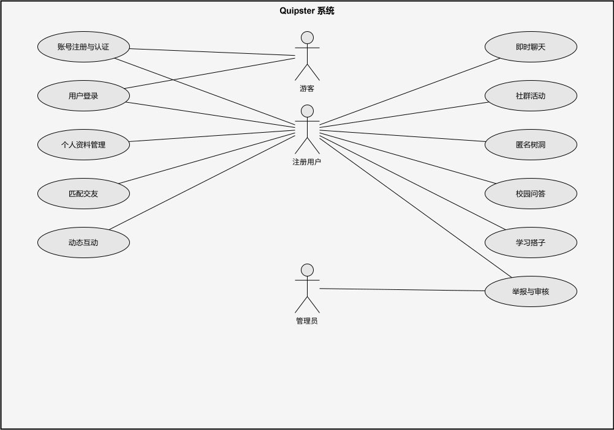

### 3.3 详细用例描述

#### 用例 1: 账号注册与认证 (UC1)

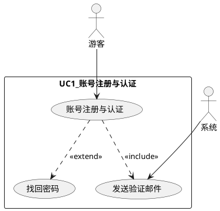

| 属性 | 描述 |
|------|------|
| **用例名称** | 账号注册与认证 |
| **用例编号** | UC1 |
| **参与者** | 游客、系统 |
| **前置条件** | 用户未注册或忘记密码 |
| **后置条件** | 账号创建并激活 / 密码重置成功 |
| **主流程** | 1. 用户进入注册页面 2. 输入同济大学邮箱和密码 3. 系统验证邮箱格式（@tongji.edu.cn 或 @stu.tongji.edu.cn） 4. 系统创建账号（状态：未验证）并发送验证邮件 5. 用户点击邮件中的验证链接 6. 系统激活账号，跳转至登录页 |
| **扩展流程** | 4a. 邮箱格式错误：提示重新输入 4b. 邮箱已注册：提示该邮箱已被使用 5a. 用户点击“找回密码”：系统发送重置邮件，用户设置新密码 |
| **异常流程** | 验证链接超过24小时未点击：账号过期，用户需重新注册 |

**活动图：账号注册与认证流程**

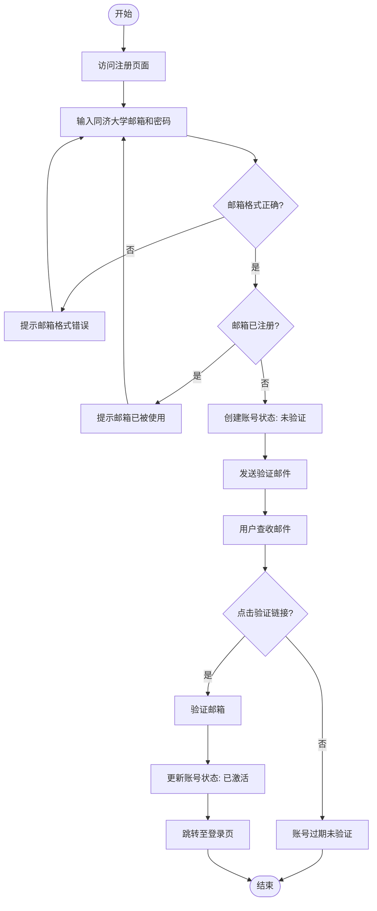

#### 用例 2: 用户登录 (UC2)

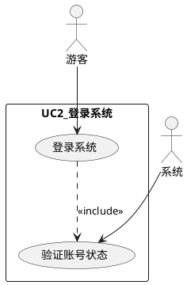

| 属性 | 描述 |
|------|------|
| **用例名称** | 用户登录 |
| **用例编号** | UC2 |
| **参与者** | 游客 |
| **前置条件** | 用户已注册并完成邮箱验证 |
| **后置条件** | 用户成功登录，进入主页 |
| **主流程** | 1. 用户输入邮箱和密码 2. 系统验证凭据 3. 系统验证账号状态（未被封禁） 4. 系统生成认证令牌 5. 跳转至用户主页 |
| **异常流程** | 2a. 密码错误：提示用户名或密码错误 2b. 账号未验证：提示请先验证邮箱 3a. 账号被封禁：提示账号已被封禁并说明原因 |

---

#### 用例 3: 个人资料管理 (UC3)

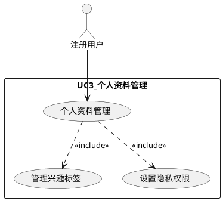

| 属性 | 描述 |
|------|------|
| **用例名称** | 个人资料管理 |
| **用例编号** | UC3 |
| **参与者** | 注册用户 |
| **前置条件** | 用户已登录 |
| **后置条件** | 资料/标签/隐私设置更新成功 |
| **主流程** | 1. 用户进入个人资料页面 2. 选择操作：编辑基本信息 / 管理兴趣标签 / 设置隐私权限 3. 用户修改相应内容 4. 系统验证并保存更改 5. 系统显示成功提示 |
| **异常流程** | 3a. 昵称或标签包含敏感词：系统提示不合规，要求修改 |

**活动图：个人资料管理流程**

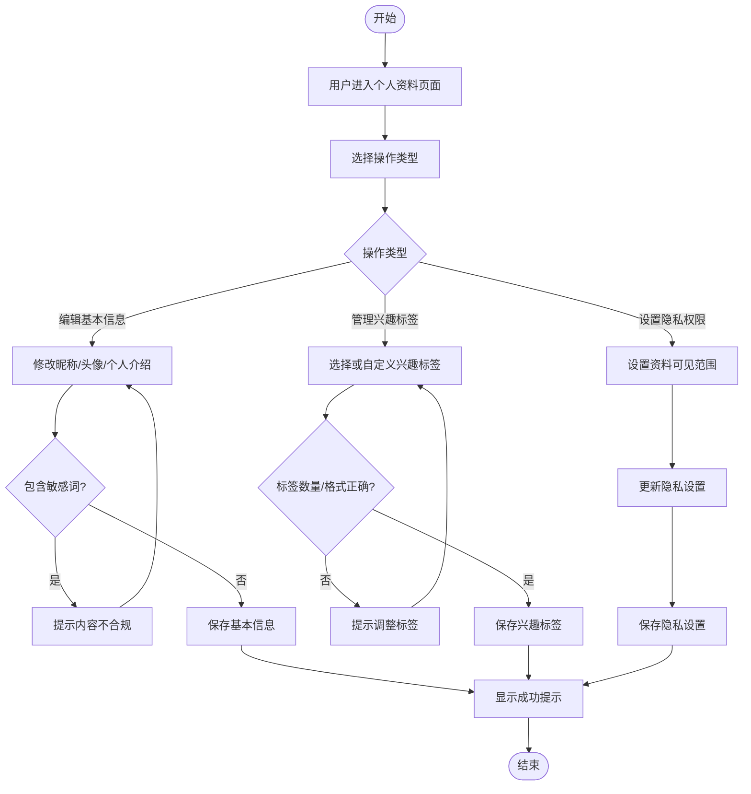

---

#### 用例 4: 匹配交友 (UC4)

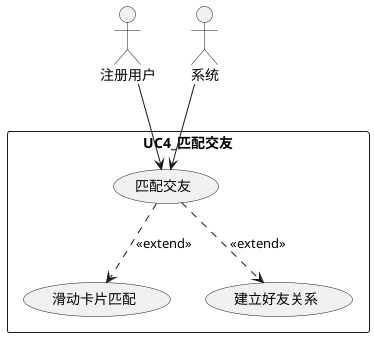

| 属性 | 描述 |
|------|------|
| **用例名称** | 匹配交友 |
| **用例编号** | UC4 |
| **参与者** | 注册用户、系统 |
| **前置条件** | 用户已登录并完善个人资料 |
| **后置条件** | 推荐用户列表展示 / 好友关系建立 |
| **主流程** | 1. 用户进入匹配页面 2. 系统基于兴趣标签、专业信息计算相似度 3. 系统以滑动卡片形式展示推荐用户 4. 用户右滑表示感兴趣，左滑表示不感兴趣 5. 若双方互相右滑，系统自动建立好友关系 6. 系统记录匹配结果并通知双方 |
| **扩展流程** | 4a. 用户右滑后对方未响应：系统暂存好感记录，待对方上线后提醒 5a. 好友关系建立后：系统推荐破冰话题 |

**活动图：匹配交友流程**

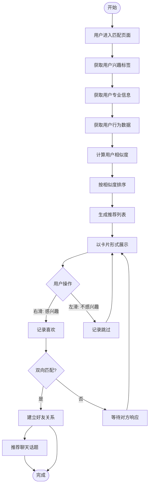

---

#### 用例 5: 动态互动 (UC5)

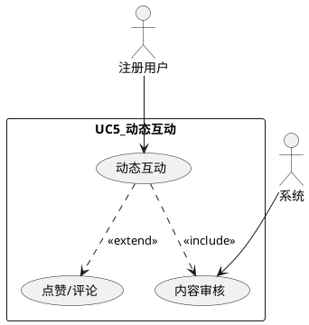

| 属性 | 描述 |
|------|------|
| **用例名称** | 动态互动 |
| **用例编号** | UC5 |
| **参与者** | 注册用户、系统 |
| **前置条件** | 用户已登录，信用分正常 |
| **后置条件** | 动态发布成功 / 互动记录生效 |
| **主流程** | 1. 用户进入动态发布页面 2. 输入内容（文字、图片），设置可见范围 3. 系统进行AI内容审核 4. 审核通过，动态发布到信息流 5. 其他用户可对动态进行点赞或评论 6. 系统实时更新互动数据 |
| **异常流程** | 3a. 内容违规：系统拒绝发布并提示原因，扣除信用分 3b. 用户信用分过低：限制发布功能 |

**活动图：动态互动流程**

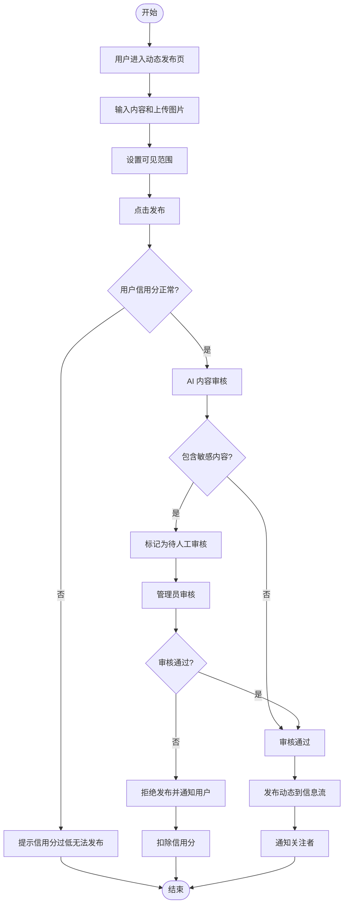

---

#### 用例 6: 即时聊天 (UC6)

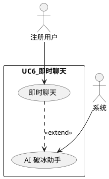

| 属性 | 描述 |
|------|------|
| **用例名称** | 即时聊天 |
| **用例编号** | UC6 |
| **参与者** | 注册用户、系统 |
| **前置条件** | 用户已登录，与对方已建立好友关系或在同一群组 |
| **后置条件** | 消息发送成功，对方收到消息 |
| **主流程** | 1. 用户选择聊天对象 2. 系统打开聊天窗口，加载历史消息 3. 用户输入消息（文本、表情、图片）并发送 4. 系统通过WebSocket实时推送消息给对方 |
| **扩展流程** | 2a. AI破冰助手：系统根据双方兴趣推荐聊天话题，用户可一键发送 |

**活动图：即时聊天流程**

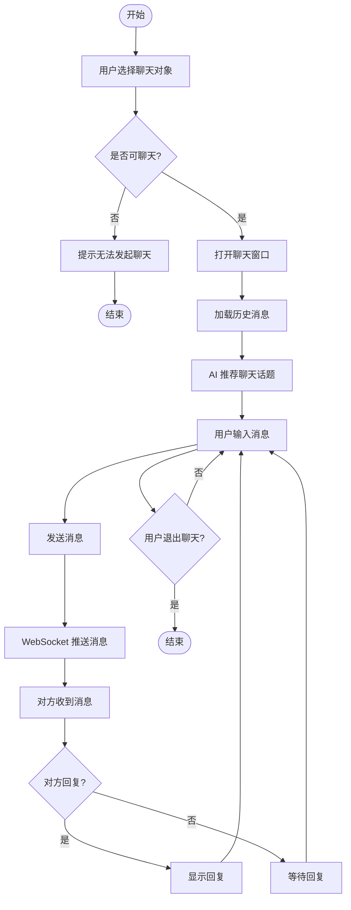

---

#### 用例 7: 社群活动 (UC7)

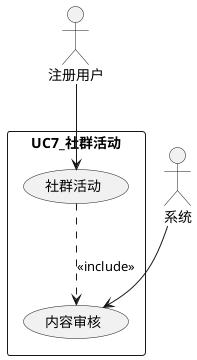

| 属性 | 描述 |
|------|------|
| **用例名称** | 社群活动 |
| **用例编号** | UC7 |
| **参与者** | 注册用户、系统 |
| **前置条件** | 用户已登录 |
| **后置条件** | 社群创建成功 / 活动发布 / 用户成功加入 |
| **主流程** | 1. 用户进入社群页面 2. 选择创建社群（需填写名称、简介、标签）或浏览现有社群申请加入 3. 社群创建/加入成功后，用户可在社群内发布活动 4. 其他用户浏览活动并报名参加 5. 系统记录报名信息并通知组织者 |
| **异常流程** | 2a. 创建社群信息违规：审核不通过，社群无法创建 |

---

#### 用例 8: 匿名树洞 (UC8)

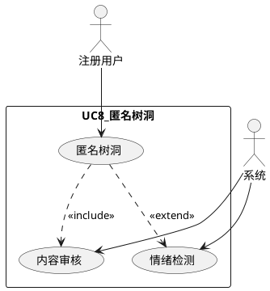

| 属性 | 描述 |
|------|------|
| **用例名称** | 匿名树洞 |
| **用例编号** | UC8 |
| **参与者** | 注册用户、系统 |
| **前置条件** | 用户已登录 |
| **后置条件** | 匿名帖子发布 / 互动成功 |
| **主流程** | 1. 用户进入匿名树洞页面 2. 发布帖子：输入标题、正文、标签，系统审核后以匿名身份发布 3. 浏览帖子：用户可查看所有匿名帖子，进行评论或点赞 4. 系统对帖子内容进行情绪检测，若为负面情绪则推荐心理支持资源 |
| **异常流程** | 2a. 内容违规：拒绝发布，警告用户并扣除信用分 |

**活动图：匿名树洞流程**

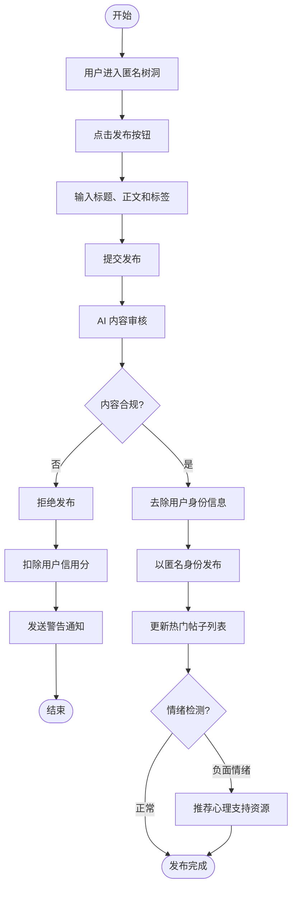

---

#### 用例 9: 校园问答 (UC9)

| 属性 | 描述 |
|------|------|
| **用例名称** | 校园问答 |
| **用例编号** | UC9 |
| **参与者** | 注册用户、系统 |
| **前置条件** | 用户已登录 |
| **后置条件** | 问题发布 / 回答提交 / 最佳答案选定 |
| **主流程** | 1. 用户进入问答页面 2. 提出问题：填写标题、内容、分类标签，系统审核后发布 3. 其他用户回答问题 4. 提问者选择一个答案作为最佳答案 5. 系统给予回答者信用分奖励 |
| **扩展流程** | 2a. AI生成参考回答：系统自动生成一个参考回答供提问者参考（不影响其他用户回答） |

---

#### 用例 10: 学习搭子 (UC10)

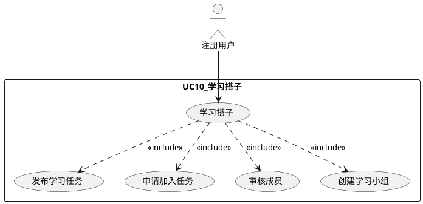

| 属性 | 描述 |
|------|------|
| **用例名称** | 学习搭子 |
| **用例编号** | UC10 |
| **参与者** | 注册用户 |
| **前置条件** | 用户已登录 |
| **后置条件** | 学习任务发布 / 小组组建成功 |
| **主流程** | 1. 用户进入学习搭子页面 2. 发布学习任务：填写课程名称、学习目标、人数要求、时间安排 3. 系统发布任务并通知相关兴趣用户 4. 其他用户申请加入任务 5. 发布者审核申请，通过后组建学习小组（自动创建群聊） 6. 小组成员开始学习交流 |
| **异常流程** | 5a. 申请人数达到上限：停止接受申请 |

**活动图：学习搭子流程**

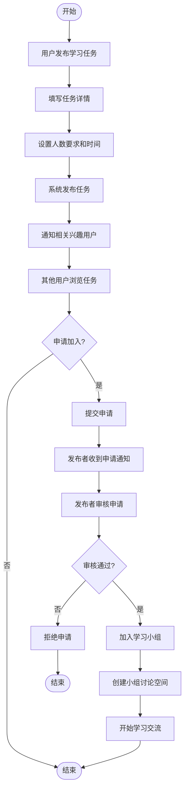

---

#### 用例 11: 举报与审核 (UC11)

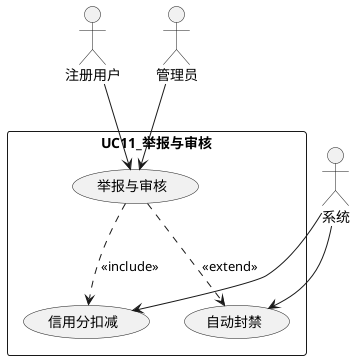

| 属性 | 描述 |
|------|------|
| **用例名称** | 举报与审核 |
| **用例编号** | UC11 |
| **参与者** | 注册用户、管理员、系统 |
| **前置条件** | 用户发现违规内容 / 管理员登录 |
| **后置条件** | 举报处理完成，信用分更新 / 内容删除 |
| **主流程** | 1. 用户浏览内容时点击举报按钮，选择原因并提交 2. 系统记录举报，通知管理员 3. 管理员查看举报详情，判定是否违规 4a. 确认违规：删除内容，扣除发布者信用分 4b. 不违规：驳回举报，通知举报人 5. 若用户信用分低于阈值，系统自动触发禁言或封禁 |
| **异常流程** | 4a-i. 多次违规：管理员可手动封禁账号 |

**活动图：举报与审核流程**

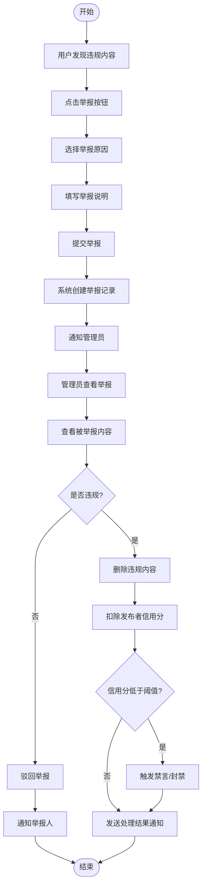

## 4. 非功能需求

### 4.1 性能需求

| 指标 | 要求 | 备注 |
|------|------|------|
| 页面加载时间 | < 5 秒 | 前端静态资源 CDN 加速 |
| API 响应时间 | < 500ms | Edge Functions 平均响应 |
| 聊天消息延迟 | < 2 秒 | Supabase Realtime 推送 |
| 并发用户支持 | 多人同时在线 | 根据 Supabase 套餐调整 |
| 数据库查询响应 | < 100ms（命中缓存） | 需合理设计索引 |
| Edge Functions 冷启动 | < 1 秒 | Serverless 特性，首次调用可能有延迟 |

### 4.2 安全需求

| 安全层面 | 措施 | 实施位置 |
|----------|------|----------|
| 身份认证 | Supabase Auth + JWT 令牌验证，密码 bcrypt 加密存储 | Supabase Auth |
| 数据传输 | HTTPS/TLS 加密 | Supabase 云平台 |
| 数据隐私 | 数据库 RLS（Row Level Security）策略，分级访问控制 | PostgreSQL |
| 敏感数据 | 密码、邮箱等私密字段加密存储，前端脱敏展示 | 数据库 + 前端 |
| 内容安全 | AI 内容审核 + 敏感词过滤 + 人工审核兜底 | Edge Functions |
| 防攻击 | CORS 配置、请求限流、SQL 注入防护（参数化查询）、XSS 防护 | Edge Functions + 前端 |
| API 密钥管理 | 前端仅使用 anon key，敏感操作通过 Edge Functions + service_role key | 前后端分离 |

### 4.3 可用性需求

| 指标 | 要求 | 备注 |
|------|------|------|
| 系统可用性 | 99.9%（SLA） | Supabase 托管服务保障 |
| 数据备份 | Supabase 每日自动备份 | 免费版保留 7 天，Pro 版 30 天 |
| 故障恢复 | 故障后 4 小时内恢复（RTO） | Point-in-time Recovery |
| 可维护性 | 模块化设计，Edge Functions 独立部署 | Serverless 架构 |

### 4.4 实时通信可靠性（NFR5）

| 指标 | 要求 | 备注 |
|------|------|------|
| WebSocket 连接稳定性 | 断线后 3 秒内自动重连 | Supabase Realtime 内置 |
| 消息投递保证 | 至少一次投递（at-least-once） | 基于数据库 WAL 持久化 |
| 在线状态同步 | Presence 机制实时更新 | Supabase Realtime Presence |
| 消息顺序性 | 按 created_at 排序展示 | 前端排序保证 |

### 4.5 数据持久性与备份（NFR6）

| 要求 | 措施 | 备注 |
|------|------|------|
| 自动备份 | Supabase 每日备份 | 免费版 7 天，Pro 版 30 天 |
| Point-in-time Recovery | 支持恢复到任意时间点 | 需 Pro 及以上套餐 |
| 数据导出 | 支持 CSV/SQL 格式导出 | Supabase Dashboard |
| 数据迁移 | 使用 Supabase CLI 迁移脚本 | `supabase db push` |

### 4.6 成本管控（NFR7）

| 资源 | 限制 | 监控措施 |
|------|------|----------|
| API 调用次数 | 免费版 500MB/月，Pro 版无限 | Supabase Dashboard 监控 |
| 存储容量 | 免费版 1GB，Pro 版 100GB | 定期清理无用数据 |
| 带宽 | 免费版 5GB/月，Pro 版 50GB/月 | 图片压缩 + CDN 缓存 |
| Edge Functions 执行时长 | 每次执行最长 60 秒 | 优化函数逻辑，避免超时 |
| 数据库连接数 | 免费版 60，Pro 版 400 | 使用连接池（Supabase 内置） |

### 4.7 开发协作规范（NFR8）

| 规范 | 要求 | 工具 |
|------|------|------|
| 接口版本管理 | API 路径包含版本号（如 `/functions/v1/`） | Edge Functions 路由 |
| 数据库迁移 | 使用 migration 脚本管理表结构变更 | `supabase migration` |
| 环境隔离 | 开发/测试/生产环境分离 | Supabase 多项目管理 |
| 代码规范 | TypeScript 严格模式，ESLint + Prettier | 前端 + Edge Functions |
| 测试策略 | 单元测试 + 集成测试 + E2E 测试 | Vitest + Cypress |
